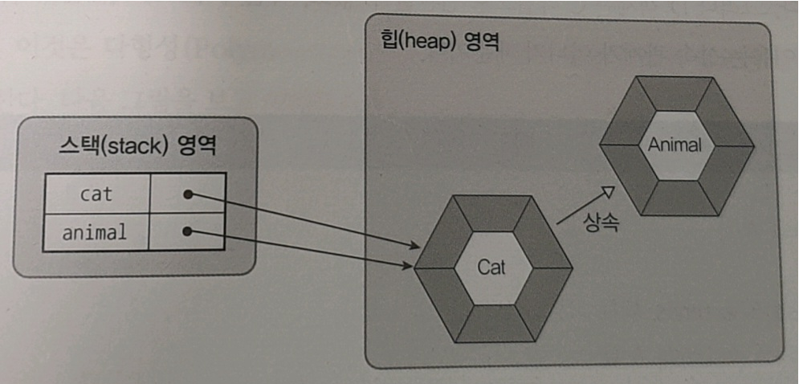

# chapter 7 상속

### 목차
- 상속 개념
- 클래스 상속
- 부모 생성자 호출
- 메소드 재정의
- final 클래스와 final 메소드
- protected 접근 제한자
- 타입 변환과 다형성
- 추상 클래스

## 상속 개념

객체 지향 프로그램에서 잘 개발한 클래스를 재사용하여 새로운 클래스를 만드는 행위

### 상속을 쓰는 이유
- 이미 만들어진 필드나 메소드를 재사용 가능하여 개발시간 절약
- 부모 클래스의 수정은 자식 클래스도 영향을 받아 수정되어 유지 보수 시간 최소화됨

```
publc class A {
  int field1;
  void method1() {}
}
```

```
public class B extends A {
  // int field1;
  // void method1() {}
  // A에서 상속된 필드와 메소드
  int field2;
  void method2() {}
  // B에서 구현된 필드와 메소드
}
```

## 클래스 상속

자식 클래스를 선언할 때 클래스 이름 뒤 extends [부모 클래스]를 붙힘

```
class [자식 클래스]  extends [부모 클래스] {
 // 필드
 // 생성자
 // 메소드
}
````

다중 상속을 허용하지 않아서 extends 뒤에 단 하나의 부모 클래스만 와야함

```
class [자식 클래스] extends [부모 클래스1], [부모 클래스2] { // (X)

} 

class [자식 클래스] extends [부모 클래스] { // (O)

}
```

## 부모 생성자 호출

자바에서 자식 객체를 생성하면, 부모 객체가 먼저 형성되고 그 다음에 자식 객체가 생성됨

```
class [자식 클래스] extends [부모 클래스] {
  // super() <- 첫줄에 부모 클래스 생성자가 자동적으로 추가되어 호출됨
}
```

만약 부모 클래스에 기본 생성자가 없고 매개 변수가 있는 생성자만 있다면
 자식 생성자에서 반드시 super(매개값)을 명시적으로 호출해야함
 
```
class [부모 클래스] {
   [부모 클래스] (int 매개값 ...) {}
}

class [자식 클래스] extends [부모 클래스] {
   super(int 매개값 ...);
}
```

## 메소드 재정의

상속받은 메소드를 자식 클래스에 맞게 사용하기 위해 메소드 재정의하는 것
자바는 매소드 오버라이딩 (@Override) 기능을 제공함

### 메소드 재정의(@Override)

자식 객체에서 메소드 재정의를 하면 부모 객체의 메소드가 아닌 자식 객체의 메소드가 호출됨

```
class [부모 클래스] {
  method1() {
    ...
  }
  
  method2() { // 오버라이드됨
      ...
  }
}
```

```
class [자식 클래스] extends [부모 클래스] {
  @Override
  method2() {
    ...
  }

  method3() {
    ...
  }
}
```

```
class Main {
  public static void main(String[] args) {
    [자식 클래스] obj = new [자식 클래스];

    obj.method1(); // 상속된 메소드, 부모 클래스에서 호출
    obj.method2(); // 오버라이드된 메소드, 자식 클래스에서 호출
    obj.method3(); // 기존의 메소드, 자식 클래스에서 호출
  }
}
```

### 메소드 오버라이드 규칙
- 부모의 메소드와 동일한 시그니처(리턴 타입, 메소드 이름, 매개 변수 리스트)를 가져야 함
- 접근 제한을 더 강하게 오버라이딩할 수 없음
  (public => default, private (x) )
- 새로운 예외를 throws할 수 없음

### 부모 메소드 호출(super)

오버라이드 했지만 원본인 부모 메소드를 호출해야 한다면 super로 호출할 수 있음

```
@Override
[메소드 이름]() {
  super.[메소드 이름](); // 메소드 원본 호출
}
```

## final 클래스와 final 메소드

클래스와 메소드 앞에 final을 붙히면 각각 상속할 수 없고 오버라이드할 수 없게됨

```
final class [클래스] {

}
```

```
class [클래스2] extends [클래스1] { // (X)

}
```

```
class [클래스] {
  final method1() {
  
  }
}
```

```
class [클래스2] extends [클래스1] {
  @Override
  method1() { // (X)
  
  }
}
```

## protected 접근 제한자

|접근 제한|적용할 내용|접근할 수 없는 클래스|
|--|--|--|
|public|클래스, 필드, 생성자, 메소드|없음|
|protected|필드, 생성자, 메소드|자식이 아닌 다른 패키지에 소속된 클래스|
|default|클래스, 필드, 생성자, 메소드|다른 패키지에 소속된 클래스|
|private|필드, 생성자, 메소드|모든 외부 클래스|

protected인 클래스는 다른 패키지여도 자식 클래스이면 접근이 가능함

```
package package1;

protected class A {
  protected String field;

  protected A() {}

  void method() {}
}
```

```
package package2;

import package1.A;

public class B extends A { <- 자식클래스이기 때문에 접근가능
    public B() {
      super(); <- super()로만 부모 클래스 생성자를 접근할 수 있음
      this.field = "value";
      this.method();
    }
}  
```

## 타입 변환과 다형성

**다형성**

같은 타입이지만 실행 결과가 다양한 객체를 이용할 수 있는 성질

**타입 변환**

데이터 타입을 다른 데이터 타입으로 변환하는 행위

자바에서는 자식 타입을 부모 타입으로 대체 가능하고 자동 타입 변환 할 수 있음
이것을 이용하여 객체는 부품화가 가능함

```
class Tire {

}

class TireA extends Tire {

}

class TireB extends Tire {

}

Tire t1 = new TireA();
Tire t2 = new TireB();
```

### 자동 타입 변환 (Promotion)

프로그램 실행 도중에 자동적으로 타입 변환이 일어나는 것

**자동 타입 변환식**
> 부모클래스 변수 = 자식클래스타입

예시
```
Cat cat = new Cat();
Animal animal = cat;

or

Animal animal = new Cat();
```

메모리의 상태

출처: 이것이 자바다

cat과 animal은 둘 다 Cat 객체를 참조함

```
cat == animal // true
// 참조 주소값이 같기 때문에 같은 객체를 참조하고 있음을 증명
```

상속 계층에서 상위 타입이면 자동 타입 변환이 일어남

```
class A {}
class B extends A {}
class C extends A {}
class D extends B {}
Class E extends C {}

A a1 = new D (O)
A a2 = new E (O)

B b1 = new E (X)
C c1 = new D (X)
```

부모 객체로 자동 변환되면 부모 클래스 멤버만 접근 가능하지만 메소드가 오버라이딩되었다면 자식 클래스의 메소드가 호출됨


출처: 이것이 자바다

### 필드의 다양성
