# 수학공부 보완

## 목적  

국비지원 학원 6개월을 다니기로 했다.  
합리적인 이유로는 
1. 자소서 및 자료정리, 포폴제작, C#외의 언어공부등 시간을 벌기 위한 의도
2. 취업트랜드에 맞게 공부
3. 모르는게 있을것에 대한 보완.
4. 회사에 맞게 사람을 변환
5. 체력기르기
6. 사회적인 긴장감을 유지할 환경을 조성

비합리적인 이유로는
1. 학원딱지
2. 게임외에 유니티사용 기업을 갈 확률이 높아진다.
3. 이 실력에 학원갈 이유가 있나?
4. 취업시장이 어덯게 될지 모른다. 3월을 보는중

4년동안 1인개발하다가 좀더 많은 노하우와 커리어가 필요하여 취업을 하기로 결정.
취업을 위한 의도로 최근 취업트랜드에 맞게 공부를 하려함

## 요구사항 & 조사

코드는 잘짜지만 아직도 수학이 약하다. 수학의 전체를 볼필요는 없고
필요한 부분만 가져가기 위한 수학공부

유니티관련 사람이어야됨.
자세히 공부하자

확인해보니 이쪽이 괜찮게 강의해주는거 같아 이걸로 선택했다.
또한 책하나 이득우의 게임수학 책을 볼 예정이다.

수포자를 위한 게임 수학
https://www.youtube.com/playlist?list=PL-xqYJ8bjgMC-p94R7iXjFCs-znRg93PJ

---

#### 20230209

### 1) OT
유니티떄문에 사람들이 공부를 안한다.

게임개발자라면 수학을 잘 숙지하고 있어야하는데
학생 및 뉴키들이 수학공부를 안한다.

수학적 배경이 부족해도 유니티는 충분히 할수 있게 만들어서
공부를 '별로' 안한다.  

유니티를 사용하더라도 수학공부는 꾸준히 해야된다  
유니티는 게임개발의 민주화를 위한 목표 아래로
누구나 게임개발을 할수 있도록 만든 엔진뿐이지.  
그렇다고 수학공부를 안해야 할정도로 작동방식은 아님.

기초부분의 커리큘럼을 만듬에도 불구하고
학생들이 별로 안할려구함. 왜냐하면 어려우니까. 그렇다고 강제로 주입할수는 없죠

게임개발도 마찬가지 파이프라인, 수학적인기반, 하드웨어구조 같은 각가지 많은 기초지식
들을 알고 있어야 게임개발을 더 깊이 있게 더 최적화된 게임을 개발할수 있다.

여기서 말하는 개발자는 게임개발자만이 아닌 게임개발을 하는 모든분들은
수학을 알고 있어야된다.

게임에 필요한 수학적인 내용들을 다룰것이다.

### 2) 피타고라스의 정리 정확한 이해

#### 20230210

//목적 : A좌표에서 B좌표의 길이를 구하기, 40/sec
20, 20 -> 100, 80 

길이를 알아야 최종걸리는 시간을 알수 있음.

수학을 할때 짜증나는건.  
용어들이 와닿지않기떄문이다.  
더짜증나는건 이것들을 영어로 알고 있어야된다.  
자료를 찾아보면 다 영어로 되있음.  

빗변 = hypotenuse = c
제곱 = (ㅊ + 특수문자) => ²  
루트(제곱근) = (ㄷ + 특수문자) => ^, √  

1. c² = a² + b²
2. c²^2 = (a² + b²)^2 (양쪽에 루트를 씌우면)
3. c = (a² + b²)^2 (가 되니 (a² + b²)^2 여기를 구하면 나옴)

고로 공식은
x좌표, y좌표끼리 빼버리는데 목적(타겟)이 주가 됨
고로 목적은 좌표값 (100, 80) 이니까
순서는
1. ((100 - 20)² + (80 - 20)²) ^2
2. ((80)² + (60)²) ^2
3. (6400 + 3600) ^2
4. (10000) ^2
5. 100

고로 길이C 값은 == 100 이다
그 다음에 100길이에서 초당 40만큼 움직이니까
time = 100 / 40 = 2.5초

---

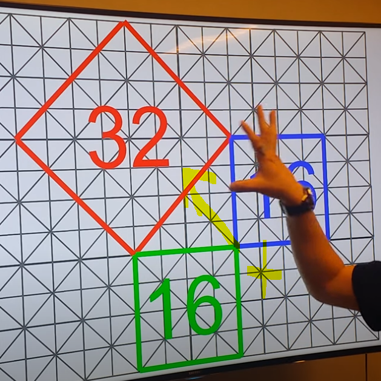

---

### 3) 선형대수학(Linear Algebra)

선형대수학을 꺼내면 많이 무서워 반응을 낸다.

사실 별거 아닌거다.
수학에서는 사전적인 정의만 말하니 확 안닿아옴.

선형대수학
선형 대수 학 두단어로 나눌 수 있다.

선형적인 공간에서 대수를 다루는 학문이다
※ 선형적이란 것은 어떤 성질이 변하는데 그 변수가 1차원적이다.
 즉 어떤 신호에 기울기만 곱한 형태와 같다는 것.
이는 직선처럼 똑바른 도형, 또는 그와 비슷한 성질을 갖는 대상을 뜻한다.

대수
미지수등과 같이 "무언가를 대신하는 수" 라서 대수 이다.

미지수를 가지고 지지고 볶고 하는걸 대수라고 한다.

프로그래밍을 하게 되면은 대수학을 쓸수 밖에 없는것이다.
우린 대수학을 계속 쓰고 있었던것이다.

선형 이라는것은 선의 형태이다

블랙홀이라든가 오그라지는 형태는 선의 형태가 아니다

3차원 2차원공간은 흔히말하는 선형 공간이다.

※ 유클리드 공간
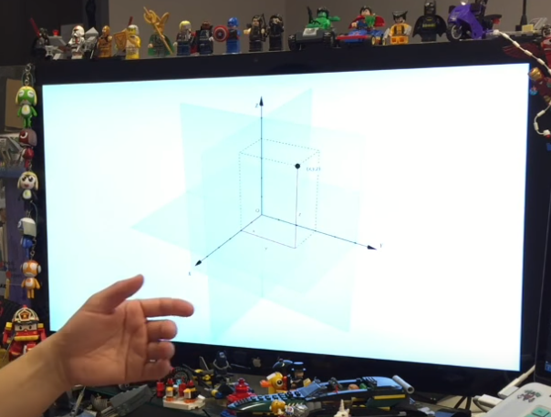

서로 직교해서 쭉 뻣어나가는공간이 유클리드 공간이다.

결국엔 유클리드공간이든 선형공간이든 우리는 계속 이공간을 쓰고 있다
우리는 알게 모르게 쓰고 있다.

선형공간을 다루면서 Vector, Matrix4x4, Quaternion

### 4) 벡터(Vector) 벡터맨은 핵아재!

(오는데는 순서가 있어도 가는데는 순서가 없다)

벡터는 화살표로 생각하면된다
화살표는 크기, 방향을 가지고 있다.
어떤곳에는 속도로 나타낼수 있고 위치로 나타낼수 있다.

벡터의 구성요소
1. 방향
2. 크기

원점에서 특정 지점

x, y가 있는 2차원벡터로 설명.

유니티에서 Transform의 position쪽

벡터는 일반숫자와 마찬가지로 덧셈연산을 가지고 있다

※ 벡터는 위에 화살표를 표현해서 이게 벡터다 라는 뜻을 가지고 있음
벡터를 나타내는 표시가 '화살표'.
덧셈 = a→ + b→ = (a.x + b.x, a.y + b.y)

평행 사변형의 중간부분의 길이가 벡터

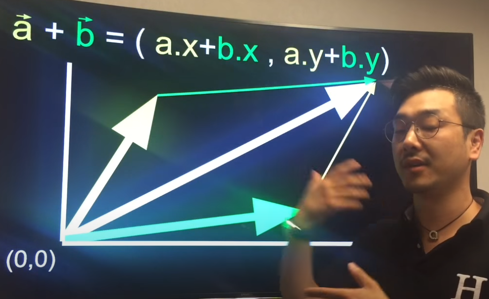

뺄셈 = a→ - b→ = (a.x - b.x, a.y - b.y)

B벡터에서 A벡터로 향하는 모습이 되고
벡터는 시작점 끝점 개념이 아니라 크기와 방향만 가지고 있어서
원점기준에서 봣을때 좌측에 있는 벡터로 표현됨.

3 - 2 =  3 + (-2)
a→ - b→ = a→ + (-b→)
이렇게 생각하면 됨.

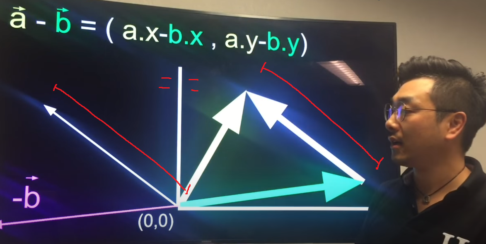

곱셈, 나눗셈

벡터에는 나눗셈이라는 개념이 없고
곱셈이라는 개념이 있는데 내적, 외적으로 두가지로 설명됨.

이번 시간에는 안다룸

-=벡터의 다른 성질
1. Length(magnitude)
(a² + b²)^2 = Length

벡터의 길이를 나타내는 기호(양옆에 짝대기를 두개씩 친다)
가끔 한개쳐도 통용은 된다. 벡터에 절대값이라는 개념이 없어서
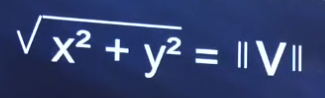

2. Normalize(단위화)
Length를 1로 만드는 과정을 노말라이징
벡터의 순수한 방향만을 나타내고 싶을때

단위만드는 방법은 
4/4 = 1 되는 방식으로,
벡터를 길이로 나누어버리면 길이가 1인 벡터가 나온다

 = (x / 벡터의 길이, y / 벡터의 길이)

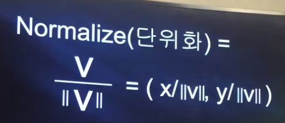

※정리
vector2 a,b;
a = b + c;
a = b - c;
a.normalize();//단위화, 순수한 방향만을 구해주는
a.magnitude();//길이를 구해주는

원리를 알고 쓰는거와 모른채로 갔다 쓰는거에는 많은 차이가 있음.

수포자의 생각하는 기준이 사람마다 달라서
오지현님의 기준은 엄청낮게 잡을것이므로 밑단부터 할 예정

### 5) 원주율 π(Pi)! 3.14 이 숫자는 도대체 무슨 의미?!

#### 20230211

벡터를 애기하다보면 내적연산을 애기할수밖에 없고
내적을 애기하다보면 삼각함수를 이야기해되고
삼각함수를 애기해야되고 삼각함수를 이야기하면
라디안을 애기해야되고 라디안을 이야기하면
파이를 알고 있어야되고, 이런식으로 엮이고
엮이고 엮여 있기때문에 파이에 대해 알아서
벡터까지 알수 있다.

매우 밑바닥부터 차근차근 애기할려고 함

파이(PI) = 3.14

#### 20230213
파이는 원주율

원주율
원의 원주에 원주율
무슨말이냐하면

원의크기를 확인할려면 

원의 지름이 있고 원주는 원의 둘레를 말하는거고
원주율은 이 원의 지름에 비례해서 원의둘레가 몇이냐
이런걸 원주율이라고 한다
원주 == 원의 둘레

바퀴가 있으면 이바퀴의 지름이 1이면
바퀴가 옆으로 쭉돌아서 한바퀴돌면
원의 둘레가 표시되는데
원의 지름이 1일때 원의 둘레의 길이는 3.14f 

원의 지름이 1이고 내적하는 육각형을 만들었을때

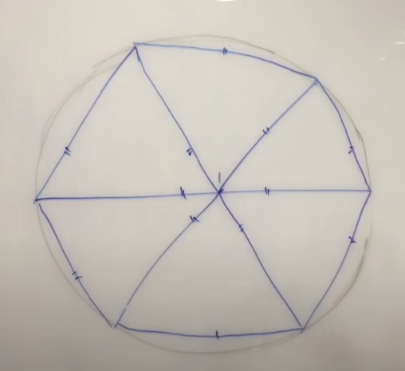

각 길이가 0.5가 된다. 반지름은 0.5이기 때문에  
그 정삼각형들의 각 선분의 길이는 0.5  
육각형일때 길이는 3  

십이각형은

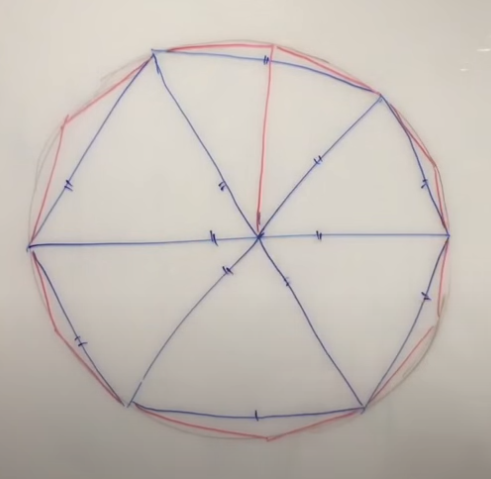

직각삼각형 구역들을  체크 

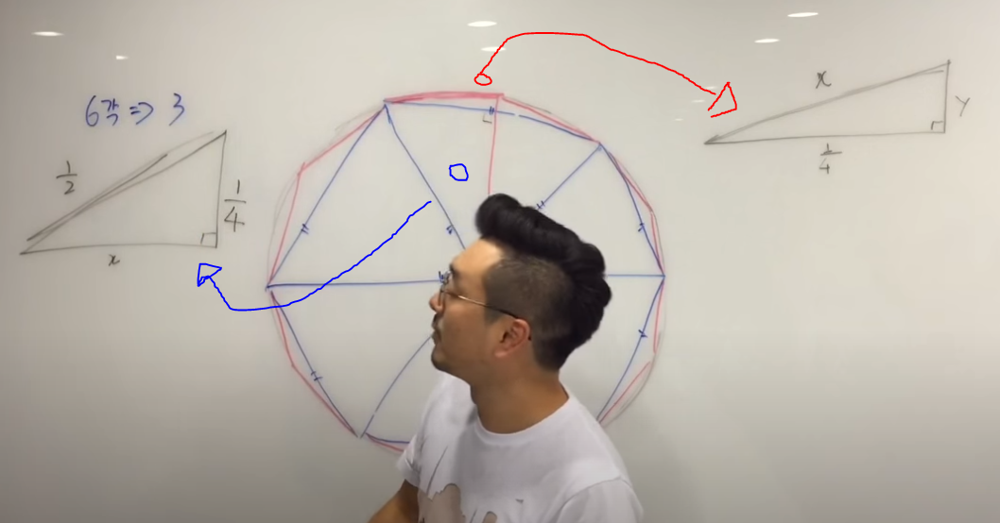

x/y 가 붙어있으면 y분의 x  
x / y 이면 나누기

x = 3^/4

y =  1/2 - 3^/4

y = (2 - 3^)/4

x² = (1/4)²  * ((2 - 3^)/4)²

수학을 할려는거지 산수를 하려는게 아니니까 여기까지 나머지는 계산기로

x = ((1/4)²  * ((2 - 3^)/4)²)^ 
  = 0.2588.... * 12 
  = 3.1058....

이렇게 하면서 계속 늘려나가고 이걸 무한히 깍아버리면 원형이 되버린다.
하지만 완벽한 원형을 만들수가 없다.
무리수니까

왠만해선
박스2D 소프트웨어 내는 10~12자리까지만 보고
우주항공에서도 15자리까지만 써서 생각보다 작게 사용함

우리가 알아야될것은 PI가 정확히 몇이다를 알아야되는게 아니고 
파이가 어떤것이고 어떤식으로 이루어져있는지 우리한테 어떤의미를 있는건지 알아야되는것이 중요하다.

### 6) 라디안(Radian) 대체 이게 뭥미?

세타 미지수
세타는 일생활해서 쓰지는않고 라디안에서 쓰는것이라서 라디안에 대해서 이야기할려고한다.

Degree, 60분법

수학을 다룰때는 
호도법
Radian

호도법 이라는건 

호의 길이로서 특정 각도를 표현하는게 호도 법이다.

정의하기로는

반지름의 길이가 1이고 호의 길이도 1이면 1라디안이라고 정의한다.
사용하는 단위로는 세타를 사용.

PI = 원주/지름 = (원주 / 2)/(지름 / 2);
PI = 반원주/반지름

(똑같이 자른다고 결과값이 달라지지않음)

반지름을 1로 두면 반원주는 PI가 된다

PI = 반원주 / 1
고로 PI는 반원주. 반원주는 180도

이걸 그림으로 표현해보면
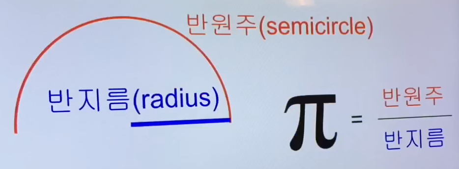

라디안에서 PI를 이야기하는것은 180도  

180도 = PI  
360도 = PI * 2  
90도 =  PI / 2  
45도 = PI / 4  

돌아와서
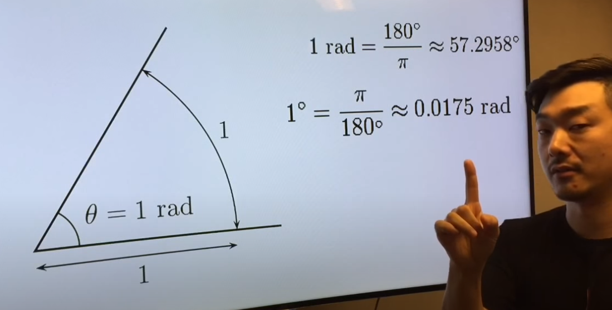

PI = 180도 이고  
라디안의 정의가 반지름의 길이가 1이고 호(원의 둘레)의 길이도 1 이면 1라디안이니까

※원주(원의둘레) / 2 = 반원주

PI = 반원주/반지름(1) = 180
1라디안 = 180/PI = 57.2958
1 = PI/180 = 0.0175라디안

라디안은 각도다

유니티에서 Mathf.Rad2Deg와 Math.Deg2Rad

이런걸 구지 설명하는 이유는 알고 쓰는거랑 모르고 쓰는거랑 상당한 차이가 있으니까

### 7) 사인과 코사인 (Sin&Cos) part.1 삼각함수의 정확한 의미!?

보통 삼각함수를 이야기하면 Sin Cos Tan를 이야기하는데
오늘은 Sin과 Cos만 이야기할거고  
Sin과 Cos만 가지고 여러패턴들을 만들수 있다.

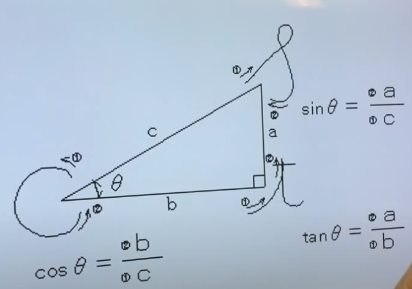

Sin이 정확히 어떤의미를 가지고 있는지
삼각함수를 이야기할때 삼각형이 아닌 원이 나온다
삼각형과 원은 땔수가 없는 친구들임

반지름이 1인 원을 단위원 이라고함.

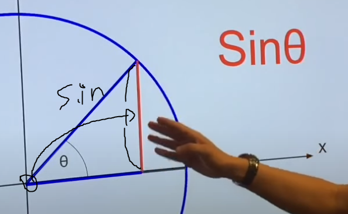

단위원에서 Sin은  
타겟팅 잡은 점정을 기준을 반대편을 길이를 Sin이라고 함  

만약 반지름이 1을 넘어섯으면  
Sin = o/h
Sin = 빗변/높이

글로쓸때는 Sin Cos 인데  
읽을때논 싸인 코싸인  
고로 코싸인은 코 싸인 인건데
상호보완적인 싸인이다.
Co 접두어는 함께 뭔가를 하는 무언가를 이야기함  

고로 Sin을 보완해주는게 Cos 이다.

이걸 그래프로 나타내면

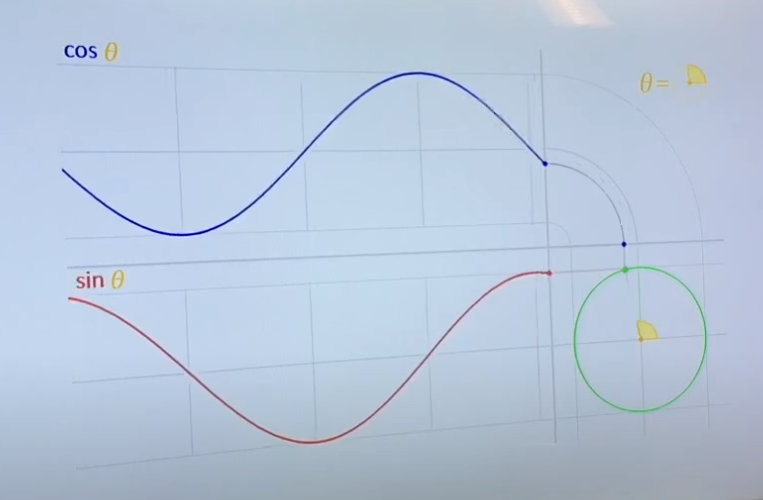

0~1로 움직이고
Sin을 Y축으로 하고
Cos을 X축으로 하면은 이렇게 원이 그려짐

3Cos(t) = 3 * Cos(t)
3 = 원의 반지름
t = 0 ~ 2PI = 0 ~ 360

2Cos(3t) = 2 * Cos(3 * t)

2 = 원의 반지름
3 = 돌아가는 스피드
t = 0 ~ 2PI = 0 ~ 360

### 8)사인과 코사인 (Sin&Cos) part.2 유니티 코드 구현

세타는 0, 360, 720 같은 각도라 무한히 늘어나는거 집어넣어도 됨
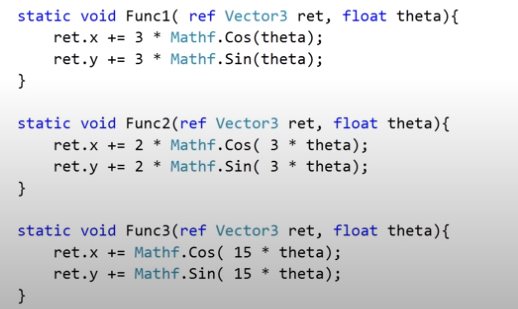

변경완료
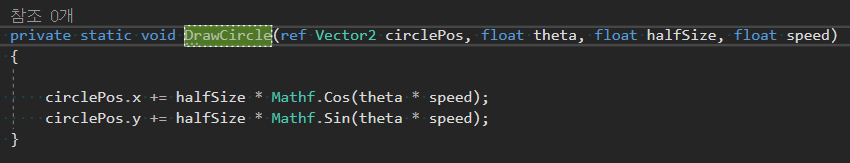

### 9)사인과 코사인 (Sin&Cos) part.3

이강의는 사인 코사인이 실제로 어디에 쓰이는지 예를 들어보는 시간.
전 강의에서는 시각적으로 어떤건지 보여주기 위한 시간이여서
실제로 게임이 사인코사인이 어덯게 활용되는지 보고싶다는분이 계셔서
간단한걸로 예를 들겁니다.

빗변 / 높이 = sin
빗변 / 밑변 = cos 

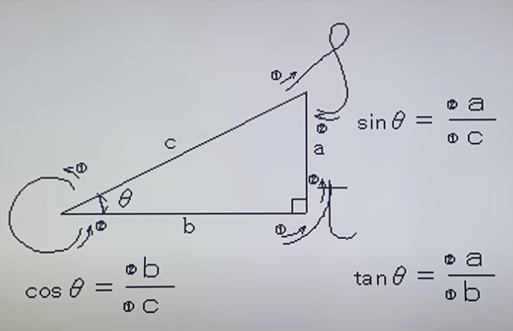

벡터의 길이가 1이다.
즉 노말라이즈가 됫다했을떄
이 벡터의 x,y좌표는 어덯게 될까

x = cos(theta)  
y = sin(theta)

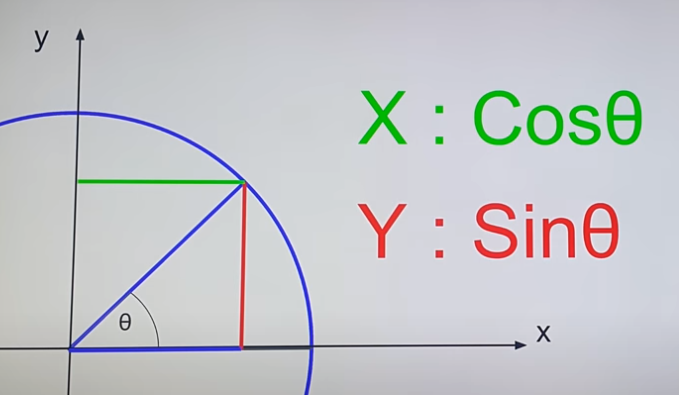

-게임에 적용한 코드

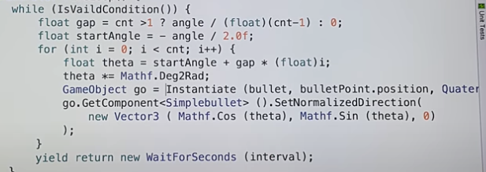

gap = 총알 하나하나의 각도  
angle = 총알이 갈라지는 최대 각도범위  
count - 1 = 총알간의 각도. (총알이 4방향으로 나가면 각도는 3부분만 필요하기떄문에 -1)
startAngle = 계산할 기준 각도
-angle / 2 를 한이유는 4사분면 음수로 표현해야됨. 최대 앵글을 반으로 나누고 거기서 음수화시킨 각도가 기준각

float theta = startAngle + gap * i;//여기는 각도로만 표현
theta *= mathf.deg2rad//여기는 각도를 라디안으로 변환

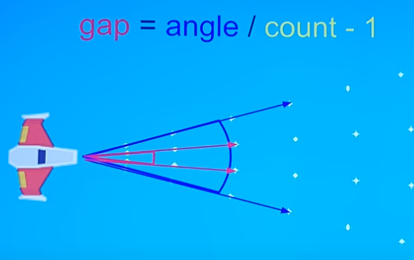
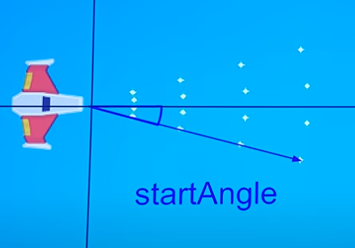

#### 20230215

### 10)탄젠트(tangent)

탄젠트의 정의는 sin/cos
 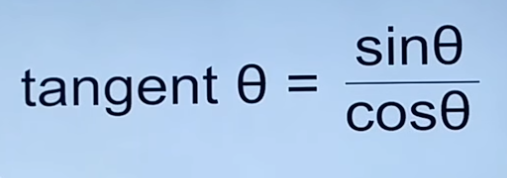

tangent(theta) = sin(theta) / cos(theta)
tangent(theta) = 기울기 = y / x = sin(theta) / cos(theta)

tangent는 **기울기** 라는 컨셉만 기억하면 된다.

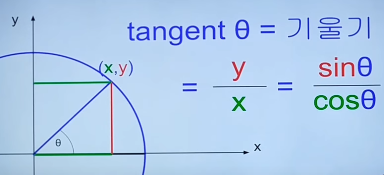

기울기를 표현할때 탄젠트가 아니라 엄밀히말하면 역삼각함수가 필요하다

theta = arcsin y
theta = arccos y
theta = arctan y

역삼각함수는
tangent(theta) = y 다 이랬을때 이 역함수는 그 반대로 만들어버림.
y가 sin
인풋과 아웃풋이 있었을때 그 인풋과 아웃풋을 바꿔버림

아크탄젠트 * y = 각도

라디안값으로 반환됨 = mathf.Atan(dir.y, dir.x);

### 11)벡터의 내적 (dot product) part.1 feat. 코사인법칙

벡터의 뺄셈과 덧셈을 다루었으니 이제 곱셈을 다룰차례인데
벡터의 곱셈은 두가지 컨셉이 있다. 하나는 **내적**이고 하나는 **외적**
그중에 내적에 대해서 말할려고함

벡터의 내적은 벡터의 곱셈이다. 그래서 점으로 표시한다.
점으로 표시하기때문에 Dot Product 라고 부르고
곱셈을 할때 a점 b점 이라고 쓰는데 이걸 줄여서 ab라고 줄여서 쓰고
근데 벡터의 내적 점은 생략할수가 없다
a * b == 벡터a * 벡터b * Cos(theta) ==
vector a, b;
(a.x * b.x) + (a.y * b.y) + (a.z * b.z)  (3차원)
(a.x * b.x) + (a.y * b.y)  (2차원)

각각 성분의 곱하고 더한게 내적이 된다.

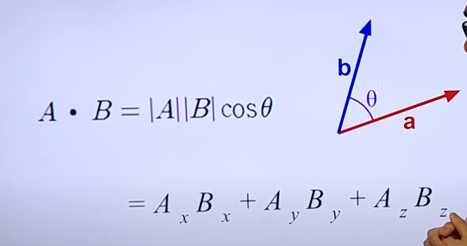

벡터의 내적은 벡터간의 투영된 길이도 나타내는 의미도 가짐.
벡터의 내적은 두벡터간의 각도를 얻어올수 있는 방법이 된다.

벡터간의 각도는 여러모로 활용되는데
예를 들어 액션게임에서 캐릭터가 몬스터를 때렸다하면 같은방향을 보냐 반대방향을 보냐
판단하는 척도를 세울수 있고

세이더에서는 조명공식에서 기본으로 사용됨.

제 1코사인법칙
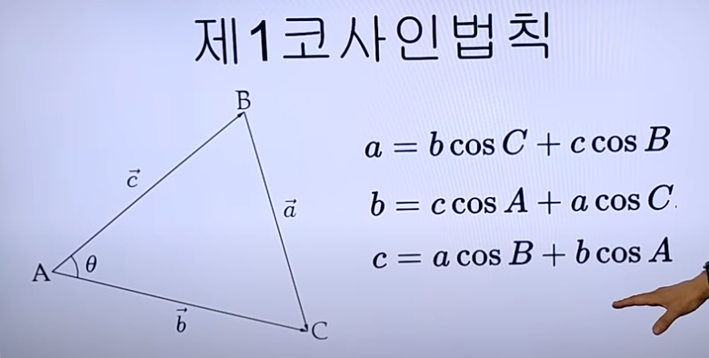

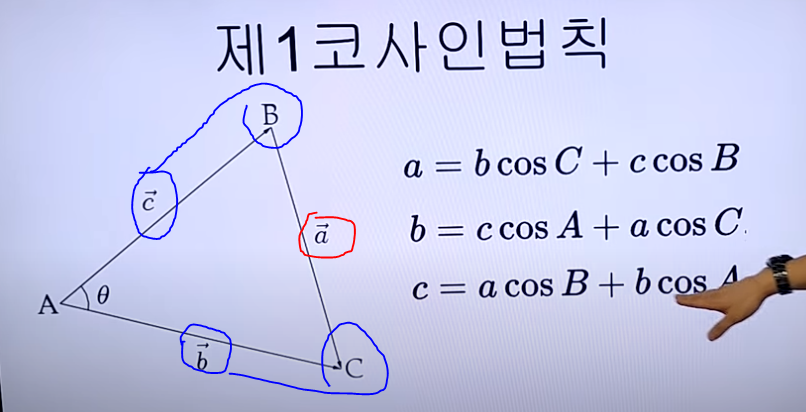

제 2코사인법칙
a² = b² + c² - 2bc cos(A) 

복잡해보이지만 코사인1법칙을 확장한것
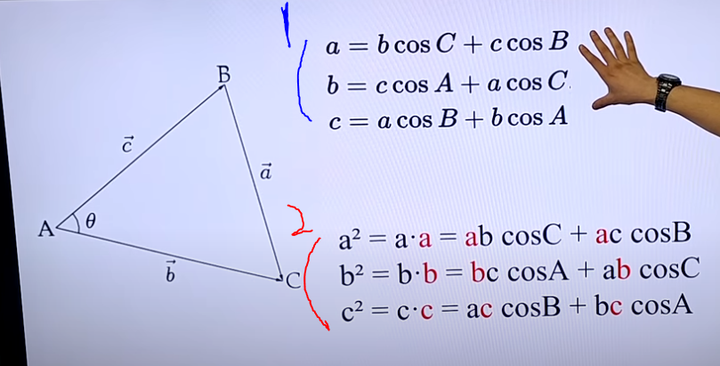

최종으로
(대문자 == 점정, 소문자 == 선분)
1법칙 
a = bcos(C) + ccos(B)
b = ccos(A) + acos(C)
c = bcos(A) + acos(B)

2법칙
a² = b² + c² -2bc cos(A)
b² = c² + a² -2ca cos(B)
c² = a² + b² -2ab cos(C)

### 12)벡터의 내적 (dot product) part.2
중고딩때 수학을 완전 포기했던 수포자였슴다. 수학은 항상찍었다.
게임개발을 시작하면서 인터넷을 뒤지고 책보면서 공부했다
수학을 안했던걸 생각해보니까. 학교에서는 수학을 암기과목으로 가르친다.
공식알려주고 왜 그러는지 안알려줌.
그래서 이 비디오 시리즈를 진행하면서 진도, 템포가 떨어져도 최대한 이해하기 쉽게
개념을 설명할려고 한다.

벡터의 내적 공식이 어덯게 나오는지 설명할려고함
vector a, b;
a * b cos(theta)  => 세이더에서 이걸 주로 씀  
a.x * b.x + a.y * b.y + a.z * b.z => 함수 오버헤드가 있어서 이걸 주로씀  

---
벡터의 내적은 벡터의 곱셈 이고.
벡터의 덧셈과 뺄셈은 벡터가 나오지만
벡터의 곱셈은 스칼라가 나오는 버전이 있기도하고 벡터가 나오는 버전이 있다.
`그래서 벡터의 내적은 벡터의 곱셈인데 스칼라로 나오는 버전이다.`
(스칼라는 scale에서 파생된 단어)

기본 개념은 여기서 출발한다.
a * a = a²; 마찬가지로 a↑ * a↑ = a↑²;

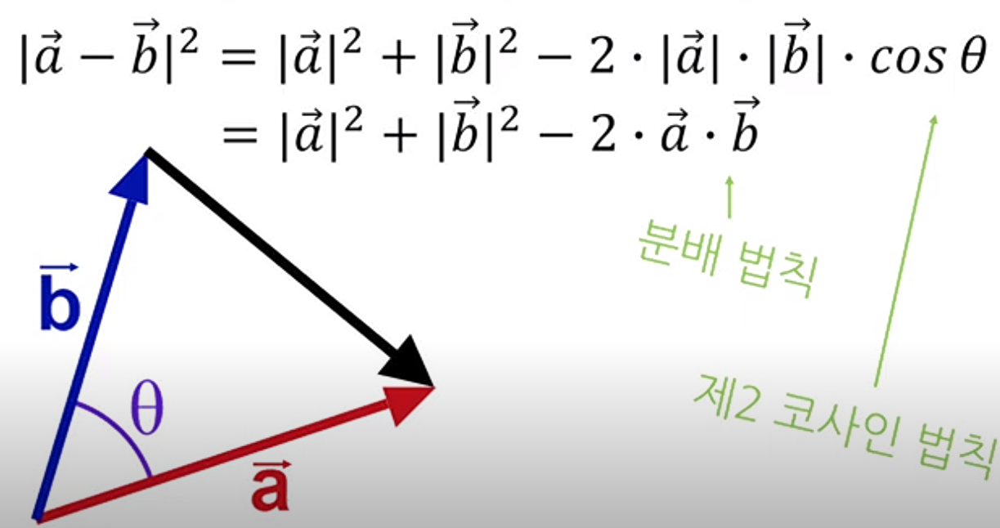
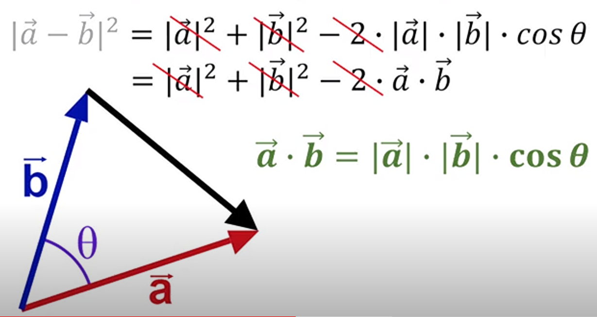

---

### 내적의 증명/유도 1번
a * b  = a↑ * b↑ * cos(theta)
벡터a 와 b 의 내적 == a의길이 * b의길이 * cos(theta)

---
이런 특성을 벡터 a, b 의 길이가 1인 상태 (노말라이즈(0~1)된상태)
이렇게 되면 그냥 cos(theta)가 됨.

1. 두벡터가 같은방향을 바라보고 있는것
theta = 0도 => 벡터a,b = 1

2. 두벡터가 90도. 수직을 이루고 있으면
theta = 90도 => 벡터a,b = 0

3. 두벡터가 서로 반대방향을 보고 있으면
theta = 180도 => 벡터a,b = -1

이라는 결과로 나옴

---

### 내적의 증명/유도 2번
파티고라스의 법칙을 체크
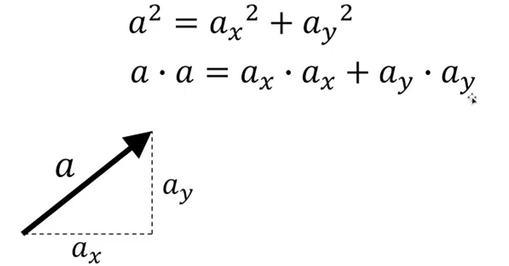

a * a = ax * ax + ay * ay;

a중에 하나를 b로 바꾸면
a * b = ax * bx + ay * by;

이렇게 하면 내적의 공식이 나옴
 
---

### 13)벡터의 내적 (dot product) 응용 1. 벡터의 곱셈

같은방향인지 다른방향인 내적을 통해서 알수가 있다

1이면 같은 방향 0이면 수직 -1이면 반대반향 이라는 특성을 사용함

총알을 진행방향을 노말라이즈, 현재오브젝트의 방향 을 내적해서
0보다 높으면 전방을 보이니까 맞았다고 체크

게임오브젝트에서 총알을 감지할떄 
OnTriggerEnter2D  
{  
    `if( Vector.Dot(총알을 진행방향을 노말라이즈, 현재오브젝트의 방향) > 0);`  
}

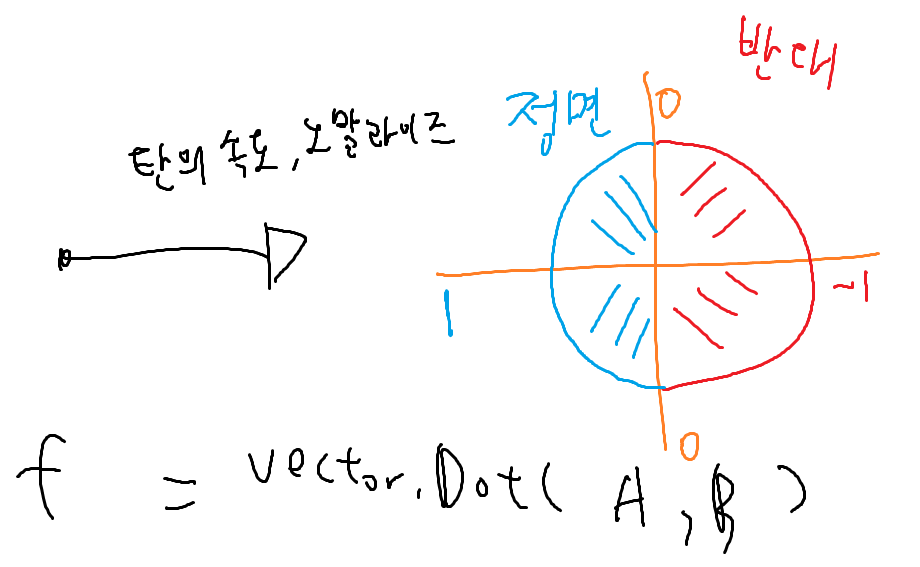

앞면뒷면을 찾을떄 딱좋아보임

## ※지금까지 소감. 오..늘고 있는게 확실히 느껴짐
이제부터는 그래픽쪽도 같이 봐야할듯

#### 20230216

### 14)셰이더 라이팅의 기본! 벡터의 내적 (dot product) 응용

벡터의 또 다른 응용에 대해서 이야기 해보는 강의

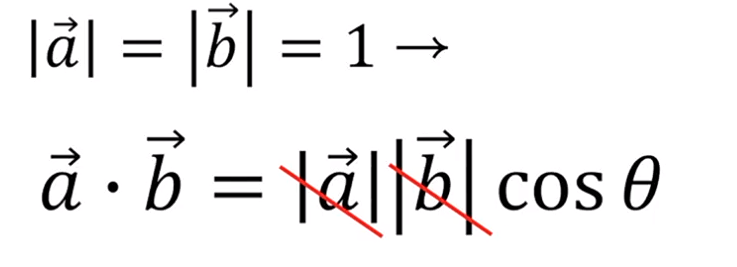

cos(theta)가 라이팅처리에서 사용됨.  
내적을 개념은 게임을 포함한 그래픽스랜더링에서 특히 라이팅처리에서 핵심적인 역할을 함  

빛의 량을 1이라고 가정하고 크기도 1이라고 가정하면

수직 = 1
45도일시 = 길이가 어느정도로 길어지는지 체크

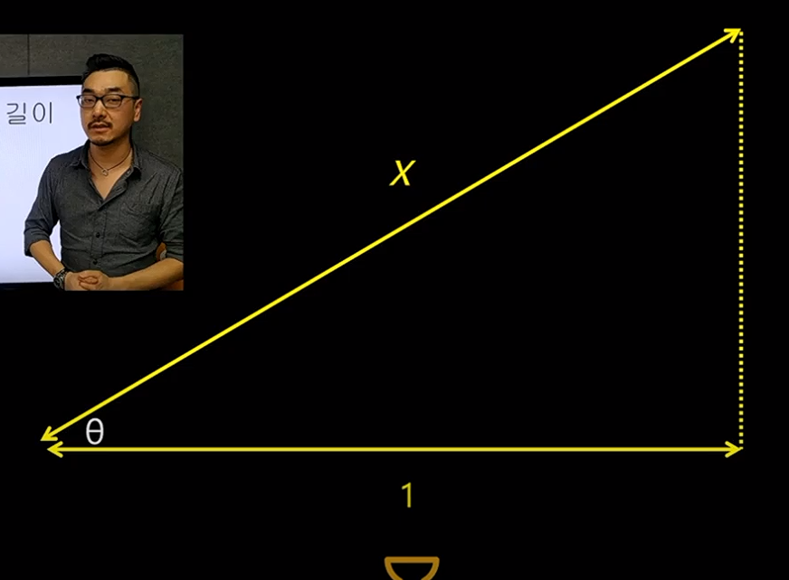

비율이 같으니까

x : 1 = 1 : cos(theta)
x / 1 = 1 / cos(theta)
x = 1 / cos(theta)

노란 삼각형안에 파란삼각형을 그린후 
이 파란삼각형의 빗변의 길이가 1이고
밑변의 길이는 cos(theta)

※ 또나옴 외우자  
sin = y = 높이 = height  
cos = x = 밑변 = width  

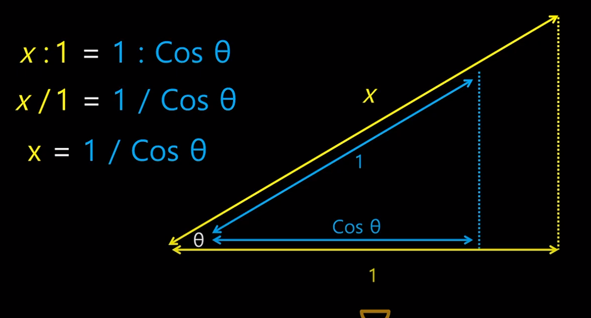

1 / cos(45) = 약1.4  
cos(theta) 사용

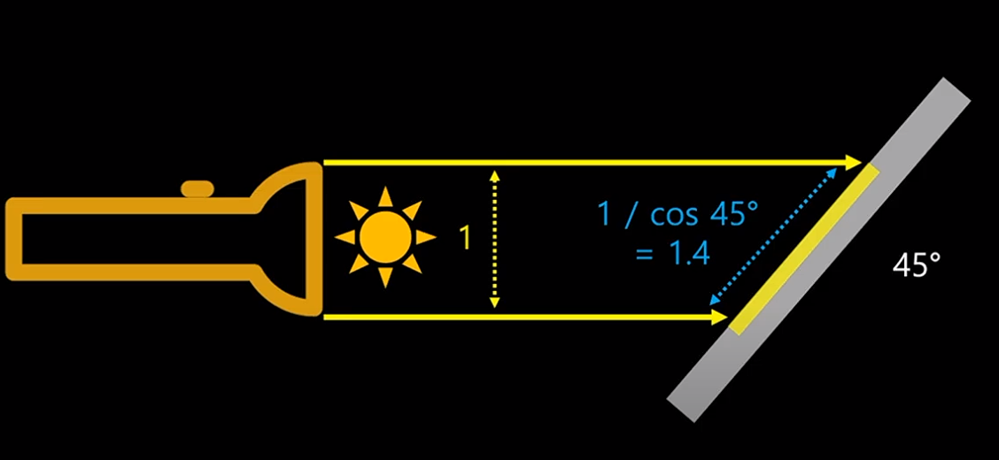

에너지 보존의 법칙
접촉이 없을때 고립계에서 `에너지의 총합은 일정하다.`

일정한 량의 빛이 들어왔을때 빛이라는 에너지를 받는 면적이 좁으면 밝아지고
넓어지면 어두워지는거

※ 빛이 닿는 면적 = 1 / cos(theta)

빛이 닿는 면적의 밝기
= 1 / 빛이 닿는 면적
= 1 / (1 / cos(theta))
= cos(theta)

결국은 빛이라는 면적에 대한 밝기는 Cos(theta).

그래서 그래픽스에서 라이트연산에서 내적을 사용

빛을 봐라보는 벡터 = Light벡터  
면의 방향에 대한 노말벡터  
를 내적한 값을 라이팅결과로 사용  

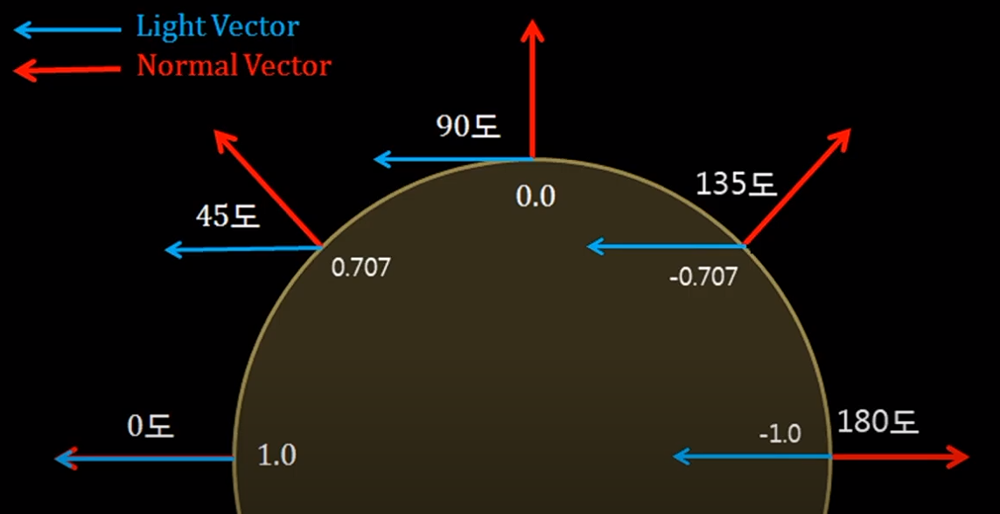

빛을 완전히 봐라보는 방향은 1이 나오고  
45도는 약 0.7로 밝기로나옴  
0.5가 아닌 Cos값인 0.7로 나옴  

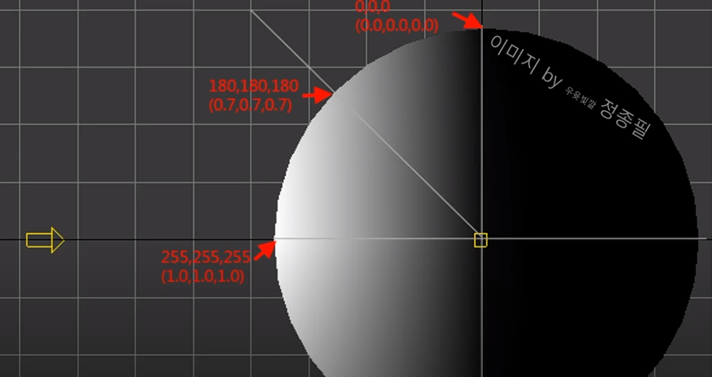

이러한 내적을 쉐이더에서 직접사용가능

벡터의 내적을 다루고 나서는 벡터의 외적으로 넘어가야되는데
벡터의 외적을 제대로 이해할려면 행렬을 다루어야됨.

#### 20230218

### 15)행렬 (Matrix) 소개와 곱셈. 매트릭스 알면 핵아재!

행렬, 매트릭스

행과 열로 이루어진 숫자의 조합, 집합

행(Row, 세로)
열(Columns, 가로)

헷깔리면
엔터키 => 개행을 생각하면된다. 그래서 행 다음줄

a1,1 => a의 1행 1열
a1,2 => a의 1행 2열

a3,3 => a의 3행 3열

간략화하면 a3, 3 a3, 2

어찌됫든 표현을 행과 열을 표현한다보면됨

행렬은 트랜스폼으로 표현될수 있다.  

우리 눈에는 포지션과 로테이션값, 스케일값따로 되있지만

내부적으로는 한묶음으로 해서 행렬적로 표현한다.
유니티뿐만 아니라 다른엔진들도 이런식으로 표현한다.

내부구조는 행렬로 사용됨
그래서 행렬이 어덯게 이루어지고 어덯게 다루어 지는지 이야기할려함

트랜스폼이 행렬로 어덯게 표현되는지

이동할때 회전할때 스케일이 변경됫을때 반영해야되는데
이런게 어덯게 반영되는지 확인

행렬의 곱셈은 얼핏봣을때 복잡해보일수 있지만
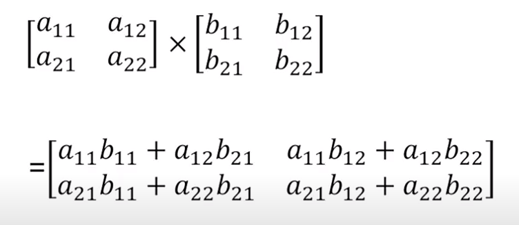

사실은 내적(벡터의곱셈)으로 이루어져있다.
vector2(a11, a12) * vector2(b11, b21)

앞 매트릭스는 행끼리 벡터로 취급.
뒷 매트릭스는 열끼리 벡터로 취급.

앞  뒤
a→  c↓ d↓
b→ 

a b c d 는 벡터

a * c  a * d  (위에꺼는 a를 곱한거)
b * c  b * d  (아래꺼는 b를 곱한거)

[a11 a12] [b11 b12]
[a21 a22] [b21 b22]

(a11 * b11 + a12 * b21) (a11 * b12 + a12 * b22)
(a21 * b11 + a22 * b21) (a21 * b12 + a22 * b22)

※기억하기(매트릭스의 곱셈)
계산할때 개행을 생각하자.
첫번쨰 개행먼저 식을 다 쓰고 그다음개행을 써가는
방식으로 쓰는 방식을 사용하자

순서가 
개행0을 기준점으로 잡고 열순서대로 내적을 먼저처리
그다음 개행을 기준점으로 위와 똑같이 수행.

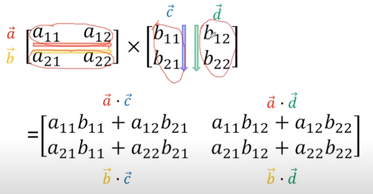

[3 1] [4 0]
[0 2] [1 2]

(3 * 4 + 1 * 1) (3 * 0 + 1 * 2)
(0 * 4 + 2 * 1) (0 * 0 + 2 * 2)

[13, 2]
[2, 4]

2by2 행렬 
행by렬

[5 3] [6 7]
[1 4] [9 8]

(5* 6 + 3* 9) (5 * 7 + 3 * 8)

(행렬곱셈 패턴? 보인다는데)
행렬의 열과 렬의 갯수가 서로곱할때 중요하고 이게 트랜스폼다룰때 중요하다

※행렬관련 궁금해서 찾아본구역
1. 덧셈 뺄셈을 하기 위해선 두행렬의 행 과 열이 서로 같아야된다
)가능
2by3은 2by3 
3by3은 3by3 

)불가능
3by2 2by3
3by3 2by2

정리 : AbyB (+-연산) AbyB == 형태여야지 계산이 가능

2. 곱셈은 앞의 렬과 뒷의 행의수가 같아야 곱셈이 가능
)가능
3by2 2by3
2by1 1by2

정리 : AbyB (**연산) BbyA == 형태여야지 계산이 가능

스칼라(어원이 스케일)
행렬의크기와 상관없이 모든원소에 일정한 상수를 곱하는것
[3,2]  2배면  [6,4]
[4,2]         [8,4]

### 16)행렬과 회전,이동,스케일

행렬의 곱이 어덯게 트랜스폼하고 연관되있는지 자세히 알아보도록함.
행렬간의 곱은 내적의 조합으로 이야기할수 있고, 내적의 조합으로 취급할려면

행렬의 행이 하나의 벡터, 열이 하나의 벡터로 취급할수 있다
이런것과 마찬가지 컨셉으로 

-=스케일  
벡터를 하나의 행렬로 취급해서 보여줄수 있다.  
1by2 2by2 는 곱할수 있음  

(Y축으로 * 2)  
[2,1][1,0]  
     [0,2]  

[2 * 1 + 1 * 0][2 * 0 + 1 * 2] = [2,2]  

-=회전  
(90도로 회전)  
[2,1][0,1]  
     [-1,0]  

[2*0+1*-1][2*1+1*0] = [-1,2]  
※아니 이런좋은게 있어? 이러니까 필요하는건구만

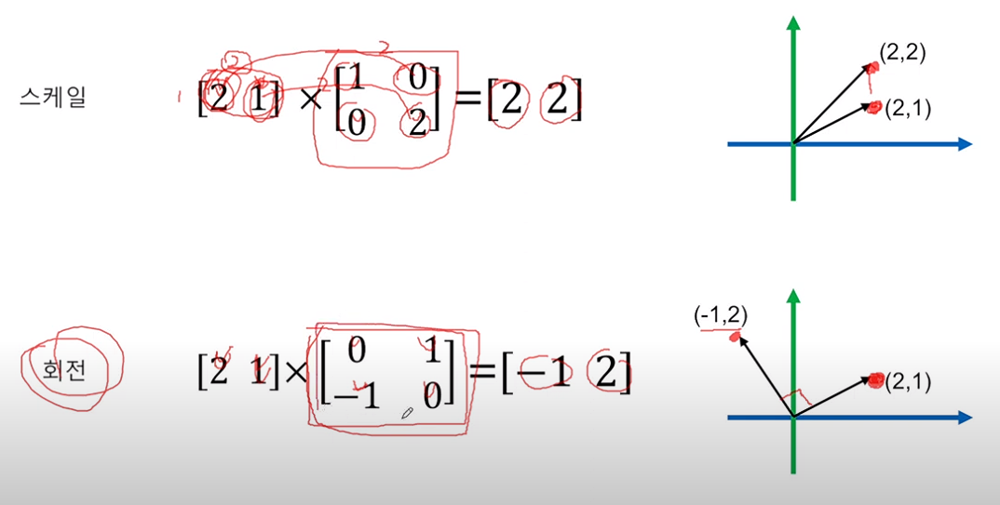

-=회전+이동
행으로 되있는 벡터는 행벡터[1,2]
렬로 표시되있는 벡터는 렬벡터[1]
                           [2] 
[2,1][0,1] + [2,-3]
     [-1,0]
[2 * 0 + 1 * -1][2 * 1 + 1 * 0]
[-1,2] + [2, -3]
[1, -1]

이러한 회전과 이동을 한번에 처리해줄수 있음

[2,1,1] [0,1,0]
        [-1,0,0]
        [2,-3,1]
[2 * 0 + 1 * -1 + 1 * 2][2 * 1 + 1 * 0 + 1 * -3][2 * 0 + 1 * 0 + 1 * 1] <=이부분을 곧장계산해서  
[0 + -1 + 2][2 + 0 + -3][0 + 0 + 1]<=이렇게 만들어버리자  
[1, -1, 1]

x,y,z(2차원벡터에 한개더 붙여서 3차원을 만들고 새로만든 곳에 1을 붙여준다)
[2,1] => [2,1,1] 붙여둔 1은 +스케일

그러면 1by3 3by3이 되서 계산할수가 있게됨.

3by3에서 
1by1 ~ 2by2부분이 회전부분
3by1 ~ 3by2부분이 이동부분

1. 회전 2. 이동 
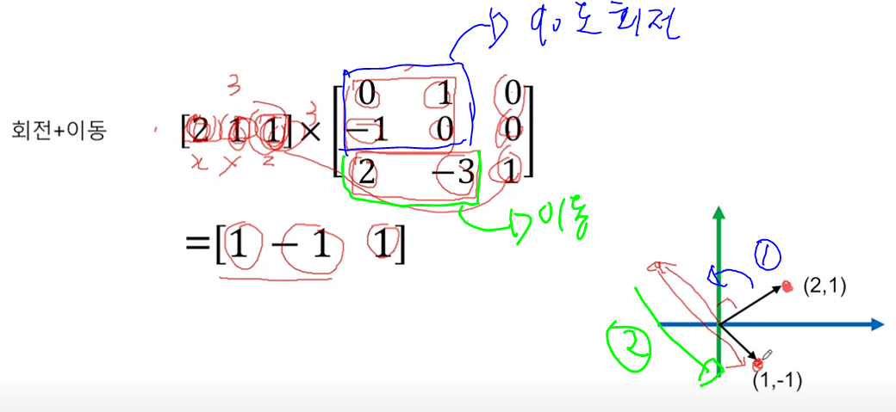

### 17)행렬과 트랜스폼

여기서는 행렬 이동, 회전, 스케일이 유니티에서 어덯게 이루어지는 면밀히 살펴본다.

유니티엔진은 3D엔진이라서 z까지 있어서 3차원으로 취급하고 처리됨

그렇기떄문에 3차원 벡터를 다루어야되고
매트릭스는 4by4 4차원벡터로 다루어져야됨.

벡터를 행렬처럼 취급하면서  
열벡터가 있고 행벡터가 있다고 했는데  
마찬가지로 매트릭스행렬도 행기준, 렬기준이 있고  

지금까지보여준건 행기준벡터로 이루어진 행기준 매트릭스였는데  
유니티는 열기준매트릭스, 열기준벡터를 다루게 된다.

 x y z Pos  
[0,0,0,0]  
[0,0,0,0]  
[0,0,0,0]  
[0,0,0,0]  

첫번째열은 X  
두번째열은 Y  
세번째열은 Z  
네번째열은 position  
x축의 방향, y축의 방향이 행렬이 기록되있다고 보면 된다.

90도를 돌렸을떄
x축 y축
[0  1 2]
[-1 0 3]
[0  0 1]

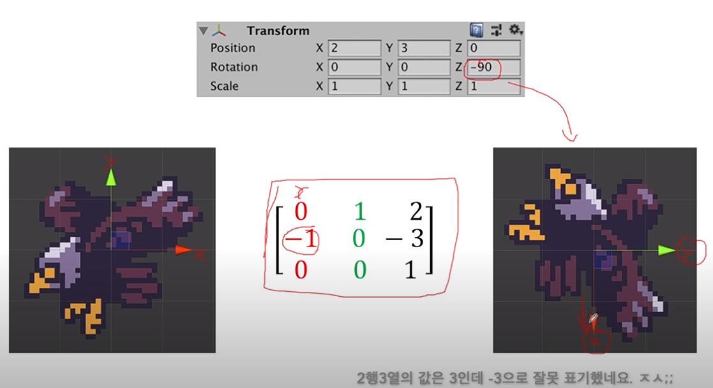

3차원벡터를 취급하고 다루기 위해서는 4by4행렬이 필요함

x축의 방향 y축의 방향 z축의 방향 위치  
[0        1          0    2     ]  
[-1       0          0    3     ]  
[0        0          1    0     ]  
[0        0          0    1     ]  

※중요시 볼게 축의방향, 노말라이즈(0~1)사이에서 왔다갔다거림
z회전할시 1by1, 1by2, 2by1, 2by2 쪽에 있는 구역들이 
x회전할시 2by2, 2by3, 3by2, 3by3
y회전할시 1by1, 1by3, 3by1, 3by3

스케일을 변경하면  
x => 1by1부분  
y => 2by2부분  
z => 3by3부분  
여기값에 곱하기 

위치를 변경하면
Pos
[x] => x방향
[y] => y방향
[z] => z방향
[1]

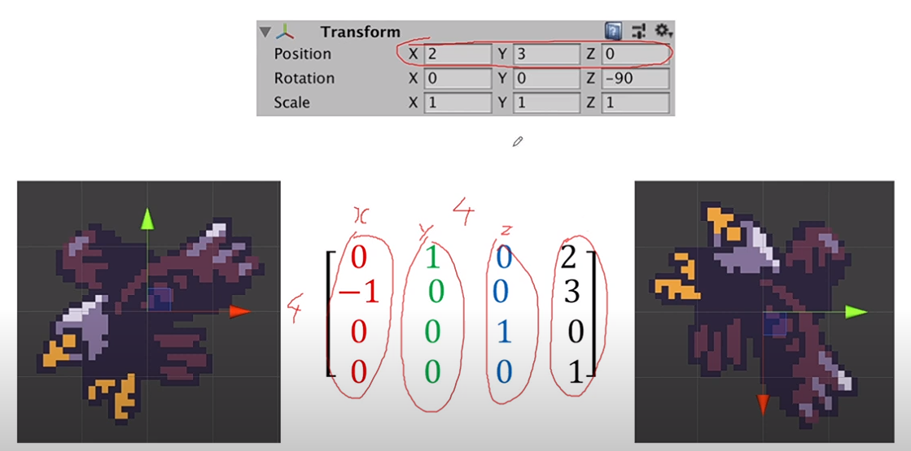

### 18)행렬(matrix)의 기준. 열(column)vs 행(row)

행기준 매트릭스
열기준 매트릭스
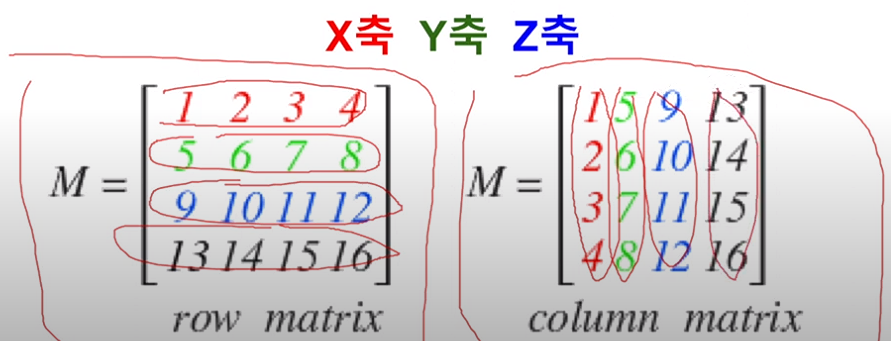

행기준 열기준 선택적인거고 3D엔진에서는 반드시 정해준 룰은 없다  
다이렉트x는 행기준이 기본값 
OpenGL은 열기준이 기본값인데  
고정사항이 아니라 선택사항이고  
OpenGL, 유니티는 열기준이니까 열기준으로 설명을 함  

※중요
벡터(v) * 행렬(m) != 행렬(m) * 벡터(v)  
같지 않고 교환법칙이 섭립이 안되서 곱하는순서가 중요함.  

열기준 행렬은 벡터하고 매트릭스를 곱할떄 이런식으로 표현됨
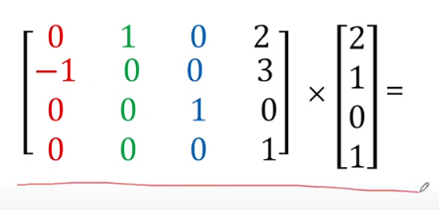

※행기준 매트릭스 벡터 곱셈
벡터가 앞, 매트릭스 뒤
vector * matrix = result

※열기준 매트릭스 벡터 곱셈(유니티는 이거 사용함.)
매트릭스가 앞, 벡터가 뒤
matrix * vector = result

matrix4x4    vector4
x y z pos(Local) 박스에 붙어잇는 독수리
[0 1 0 2]       [2] => x
[-1 0 0 3]      [1] => y
[0 0 1 0]       [0] => z
[0 0 0 1]       [1] => w
            독수리의 월드위치
0 1 0 2     [3]
-2 0 0 3    [1]
0 0 0 0     [0]
0 0 0 1     [1]

곱하는 방법은 같음

4by4 4by1 계산가능
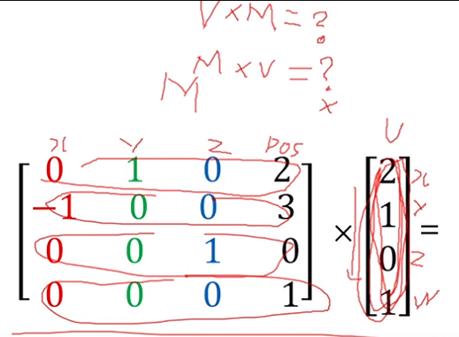

유니티의 오브젝트들은 종속관계로 계층구조로 이루어짐
부모노드가 회전하면 자식한테도 영향을 미침
이런식으로 3D공간에서, 계층구조공간에서 포지션, 로테이션, 스케일
행렬연산에 의해서 결과가 반영됨.
그래서 3D공간을 다룰때 이런행렬에 대해서 알고 있으면 트랜스폼에 대해  
완벽히 이해하고 다룰 수 있게되는것이다

### 19)삼각함수 덧셈정리 : 코사인편

회전행렬에 대해서 다루어봄.  
행렬가지고 이동, 스케일, 회전다루는걸 이야기했는데  
그중 회전행렬을 좀더 자세히볼려고함  

삼각함수에 대한 덧셈정리 외우는법
1. 신코픈꽃신 sin(a+b) = sin(a)cos(b) + cos(a)sin(b)
             sin(a-b) = sin(a)cos(b) - cos(a)sin(b)
2. 고구마사소 cos(a+b) = cos(a)cos(b) + sin(a)sin(b)
             cos(a-b) = cos(a)cos(b) - sin(a)sin(b)

갑자기 삼각함수의 덧셈정리를 왜 말하냐 라면
이 회전행렬을 구할때 삼각함수의 덧셈정리가 이용됨.
행렬회전 구하기 이전에 삼각함수덧셈정리를 이해해야 가능하다

P = (cos(a), sin(a))  
각도는 a  

q = (cos(b), sin(b))  
각도는 b  

p와 q사이의 각도를 theta라고 해두고  

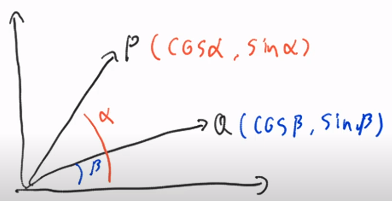

-=z축 회전행렬
[cos(theta) -sin(theta) 0]
[sin(theta) cos(theta)  0]
[0          0           1]
내적의 정의에 대해 다시 이야기함

벡터p, q의 내적은
p의 길이 * q의 길이 * cos(theta)
여기서 p,q의 길이를 = 1로 두면
cos(theta)만 남고  

cos(theta) == cos(a-b);  
px * qx + py * qy == cos(a)cos(b) + sin(a)sin(b);  

이렇게 내적의 공식자체가 삼각함수의 덧셈자체가 되는것이다.

cos(a+b) = (cos(a-(-b))) == cos(a)cos(-b)+sin(a)sin(-b)

r = 1이면
-y/r    -y
x/r     x

cos은 x값이라 x값은 동일하다.
cos(-theta) == cos(theta) 라 결과가 똑같다

sin은 y이라 
sin(-theta) == -sin(theta) 는 같은값으로 도출됨.  

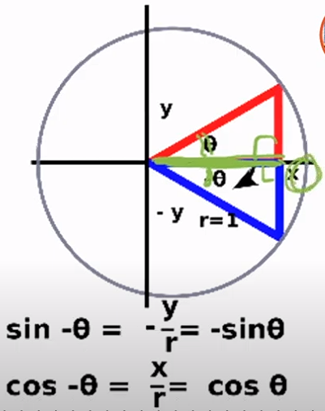

다시보면
cos(a+b) == (cos(a-(-b))) 
== cos(a)cos(-b)+sin(a)sin(-b)

코사인x는 동일한 값이 나오니까 -b => b로 만듬
== cos(a)cos(b) + sin(a)sin(-b)

사인-b의 부분이 앞으로 나오면서 변경
== cos(a)cos(b) - sin(a)sin(b)

### 20)삼각함수 덧셈정리 : 사인(sin)편

sin(0) = 0
cos(0) = 1

sin(90) = 1
cos(90) = 0

90도 == PI/2;

sin하고 cos하고는 90, Pi/2 만큼 차이가 남

sin(a+b) == cos(PI/2 - (a+b)) == cos(PI/2-a-b)
=>(PI/2-a)-b) 이렇게 묶어서 계산
=>cos(a-b) = cos(a)cos(b) + sin(a)sin(b) 이공식을 대입
그러면 밑에 공식으로 변함

== cos(PI/2-a)cos(b) + sin(PI/2-a)sin(b)
=>여기서 PI/2 - a == sin(a), PI/2-a == cos(a)

sin(a+b) = sin(a)cos(b) + cos(a)sin(b)
sin(a-b) == sin(a-(-b))
== sin(a)cos(-b) + cos(a)sin(-b)
=>cos(-theta) == cos(theta)랑 같으니 이걸적용하면

sin(a)cos(b) - cos(a)sin(b) 가 나옴

그래서 삼각함수의 덧셈정리를 증명함
※공식 4개다 해야지 증명이 되는것.

####20230222
### 21)회전 행렬

z축 회전행렬

위치나 스케일보다 까리까리해서 회전행렬이 왜이렇게 나오는지 이해해보려고함

Q의 각도는 b
Q에서 P로 넘어가는 각도는 a

P의 각도는 a+b가 될텐데, 최종적으로  
P의 각도는 cos(a+b), sin(a+b)
Q의 각도는 cos(b), sin(b)

덧셈정리를 그대로 쓰면 된다
Px == cos(a+b) == cos(a)cos(b) - sin(a)sin(b)
Py == sin(a+b) == sin(a)cos(b) + cos(a)sin(b)

=> Q의 x는 cos(b), y는 sin(b) 이면

Px == cos(a)Qx - sin(a)Qy + 0 (의미없는 0을 더해봄)
Py == sin(a)Qx + cos(a)Qy + 0 (의미없는 0을 더해봄)

=> 이걸 행렬로 표현해보면

[cos -sin 0][Qx] =  [Px]
[sin cos  0][Qy] =  [Py]
[0   0    1][1]  =  [1]

이게 바로 Z축기준으로 회전을 한 회전행렬

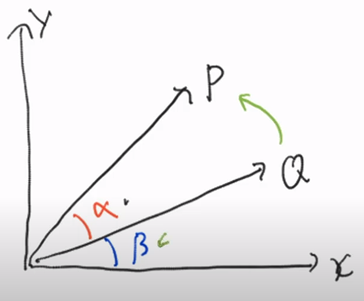

### 22)왼손 좌표계 vs 오른손 좌표계

좌표계관련해서 이야기할려고함  
좌표축이면 x, y, z 축이 있는데  
각툴마다 x, y, y축의 방향이 다를다  

이런건 크게 두가지로 나눌수있다.
왼손 좌표계, 오른손좌표계

#### -=오지마술사

-=유니티는 왼손좌표계  
모니터 너머가 Z  
위로 향하는게 Y  
우측으로 향하는게 X  

x축이 오른쪽을 향하는지 (왼손)  
y축이 왼쪽을 향하는지 (오른손)  

프로그램마다 축이 다 다름.

그래서 좌표계 왼손좌표계, 오른손좌표계 따지는게  
이 3D공간을 다룰때 중요한 포인트가 되고  
이런점을 알고 있어야 행렬 내적 각가지 3차원공간을 다룰때 기반이되는 구역이다  

####20230225
### 23)행렬의 형태들 Part1. 개념 설명

전치행렬(Transpose Matrix)
직교행렬(Orthogonal Matrix)
단위행렬(Identity Matrix)
정방행렬(Square Matrix)
역행렬(Inverse Matrix)

여깃는 내용들을 다룬다면 몇시간을 다루어도 못다룸.
수학을 배우는데 이유도 모르고 어디에 써먹는지도 모르는상태로 막배우는데  
흥미도 떨어지고 이해도도 떨어질수 밖에 없는데,  
저는 여러분들이 최대한 흥미도 가지고 이해할수 있게 초점을 맞출려고함.

행렬같은경우 일반적인 로직에서는 사용하지않는데
그래픽요소를 다룰때는 필수적으로 사용됨.  

위에 보여준 항목들은 쉐이더를 다루기 위해서는 
필수적으로 알아될 항목들이다.

### 1. 전치행렬(Transpose Matrix)

행벡터기준으로 되있다고 하면 이걸 열벡터기준으로 바꿔준다는것
행과 열을 요소들을 바꿔주는것

[x1 x2 x3]   [x1 y1 z1]
[y1 y2 y3] =>[x2 y2 z2]
[z1 z2 z3]   [x3 y3 z3]

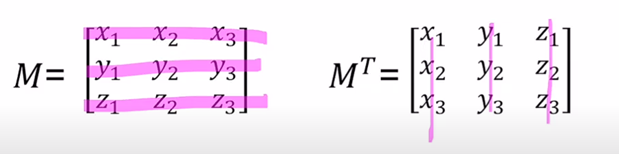

### 2. 직교행렬(Orthogonal Matrix)

일반적인 수학책 설명이 복잡하고 와닿지 않게 되있음.

유니티에서 기즈모들이 직각으로 되있는데 각축들이 직교를 이루고 있는 형태를 의미한다.
만약 트랜스폼로테이션을 3by3행렬로 나타낸다면 x, y가 직교,  y, z가 직교

어덯게 회전하든간에 각축들은 서로간의 90도를 항상 유지함.

※의미
ㅗ => 직교
ㄴ => 직각

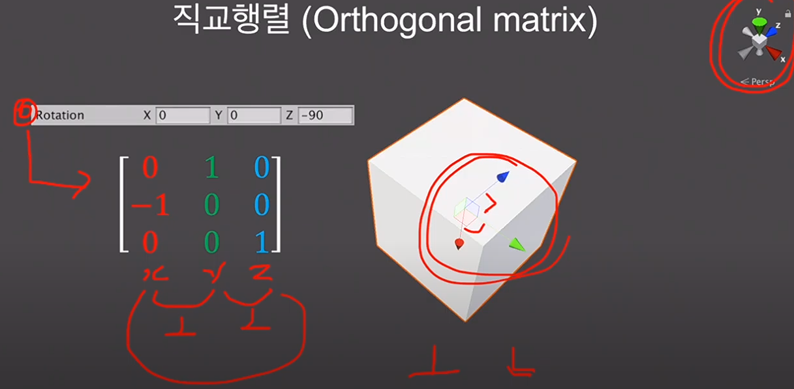

### 3. 단위행렬(Identity Matrix), 항등행렬(옛날번역서 느낌)

이렇게 된게 단위행렬이라고한다. 가운데부분만 1로 되있는, 단위행렬은 I라고 씀
    [1 0 0 0]
I = [0 1 0 0]
    [0 0 1 0]
    [0 0 0 1]

하이어라키의 유니티 트랜스폼으로보면 이상태가 단위행렬상태라고 부른다.
Position 0 0 0
rotatation 0 0 0
scale 0 0 0
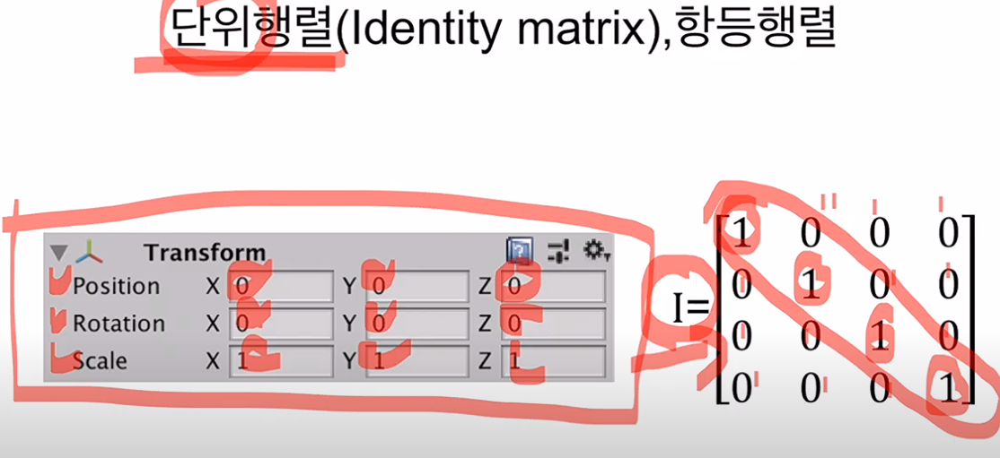

### 4. 정방행렬(Square Matrix)
행과 열의 갯수가 같은 행렬이 정방(정사각형)행렬이라고한다.
정사각형 형태인 행렬이다.
4by4 3by3 같은 정방행렬
우리가 다루는 트랜스폼은 정방행렬이다라는걸 기억했으면 좋겠다.

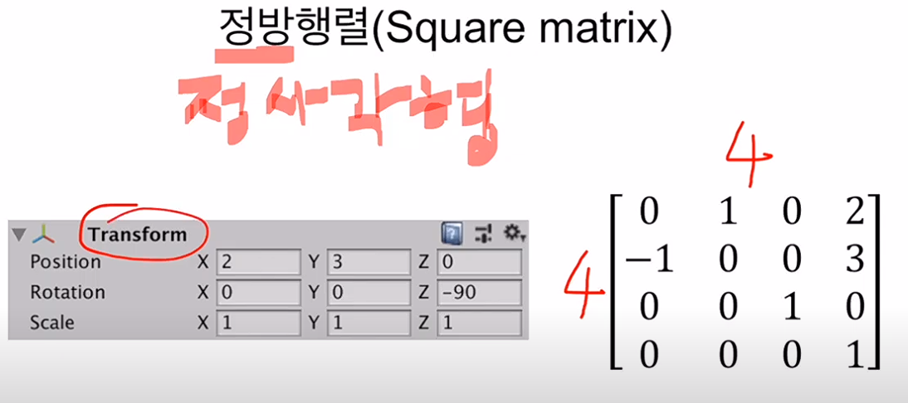

### 5. 역행렬(Inverse Matrix)

역행렬은 행렬의 역수같은 개념이다. (역수란 분자와 분모를 바꾼수)

숫자 x라는게 있을떄, x의 역수는 x(-1) 1/x로 표현하는데

x * x(-1) == x * 1/x == 1

벡터 2,1 => 벡터3,1 로 이동시키고
벡터 3,1 => 벡터2,1 로 이동시키는 관계

[0  1 0 2][2] = [3]
[-1 0 0 3][1] = [1]
[0  0 1 0][0] = [0]
[0  0 0 1][1] = [1]

[0 -1 0  3][3] = [2]
[1  0 0 -2][1] = [1]
[0  0 1  0][0] = [0]
[0  0 0  1][1] = [1]

위와같은 관계를 역행렬이라고 함.
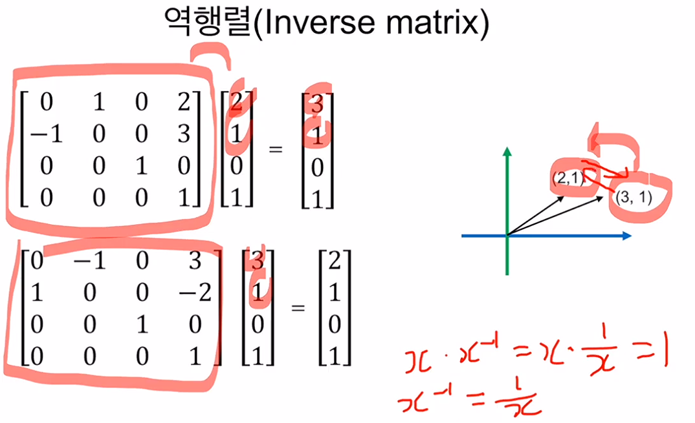

행렬의 역행렬은 -1을 붙여서
m * m(-1) == I 로 표현을 함.

어떤행렬 * 역행렬 == 단위행렬이 된다.
마찬가지로 순서를 바꿔서 배치해도 단위행렬이 나온다.

역행렬이라는건 어떤행렬이 트랜스폼을 나타낸다면 그행렬의 역행렬은 그트랜스폼을 돌려놓는 행렬을 의미한다.

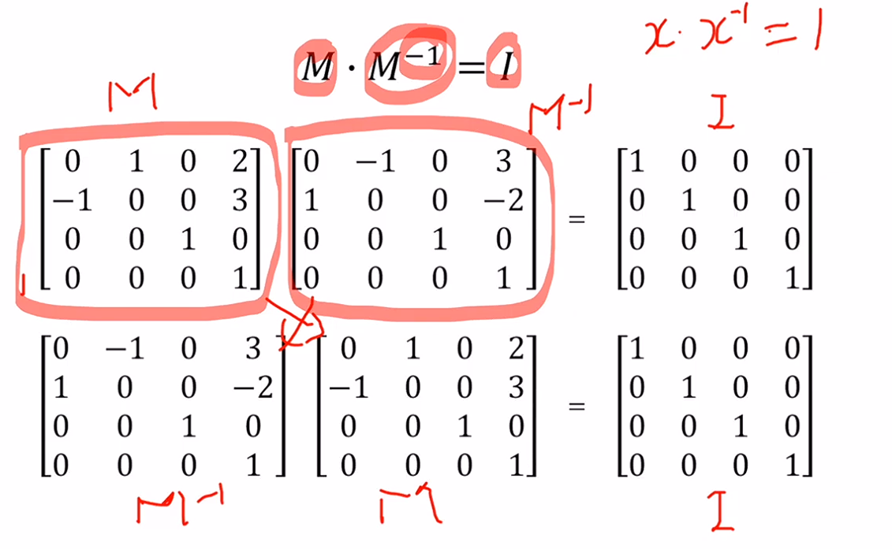

### 24)행렬의 형태들 Part2. 유니티 코드 구현

정방행렬이고 직교행렬일때는 
회전값에 의한 역행렬과 전치행렬은 동일하다

이동할때 문제가 생김.
회전할때에 대한 이동값을 대입해야됨

회전(+스케일)역행렬 * 이동역행렬 == 트랜스폼역행렬
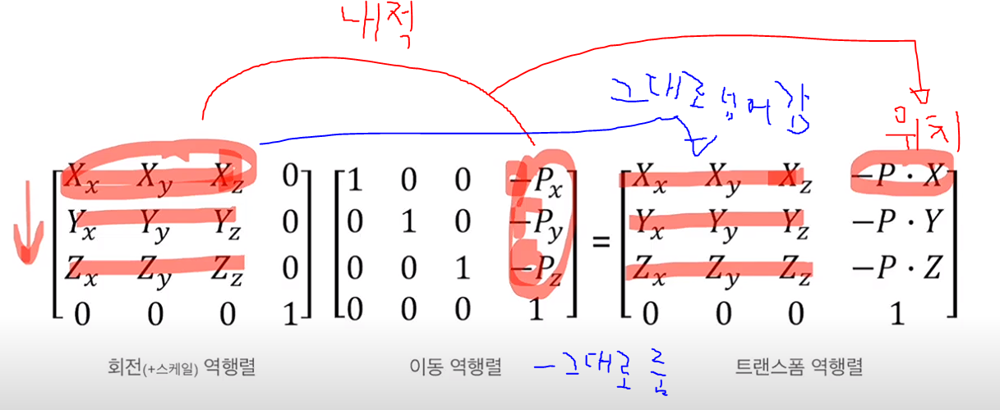

이렇게 간단하게 구성할수 있는건 우리가 다루고 있는 트랜스폼 행렬이  
정방행렬이고 직교행렬이기때문에 가능하다.  
정방행렬이고 직교행렬과정 전제가 없어진다면 역행렬 구하는게 엄청 복잡해짐.  

우리가 게임을 다룰때 그래픽스를 다룰때 정방행렬, 직교행렬이다라고 가정을 해도 크게 무리없다.  

이번 비디오에서는 역행렬관련해서 많이 강조해서 말했는데. 역행렬이 많이 필요한개념이어서 그렇다.  

####20230226
### 25)좌표변환/버텍스변환 - WVP transform. 쉐이더를 다루기 위해 필수적으로 알아야 하는 변환

좌표변환(Coordinate Transformation)
버텍스변환(Vertext Transformation)

유니티에서 사물을 랜더링하기 위해선 메쉬가 존재하고 그메쉬가 씬에 배치되야되는데
그씬에서 트랜스폼위치값을 가지고 월드포지션에 배치가 됨.

World -> View -> Projection

흔히 사용하는 메쉬에 대해서 이야기를 해야한다.

도형이 생길려면 일단 점이 있고 점과 점사이가 연결되서 삼각형이 만들어지고
삼각형들이 모여서 메쉬로 변함.

점 => 버텍스(Vertices, Verts)
선 => 에찌(Edge)
폴리곤 => polygons(Polys)
사전적의미는 다각형. 그래픽에서는 최소도형단위인 삼각형을 이용해서 폴리곤을 만듬.  
그래픽스랑 게임에서 폴리곤이라는건 삼각형이라고 말함.  
폴리곤을 이용해서 메쉬를 말함  
도형 => 메쉬(Mesh)  

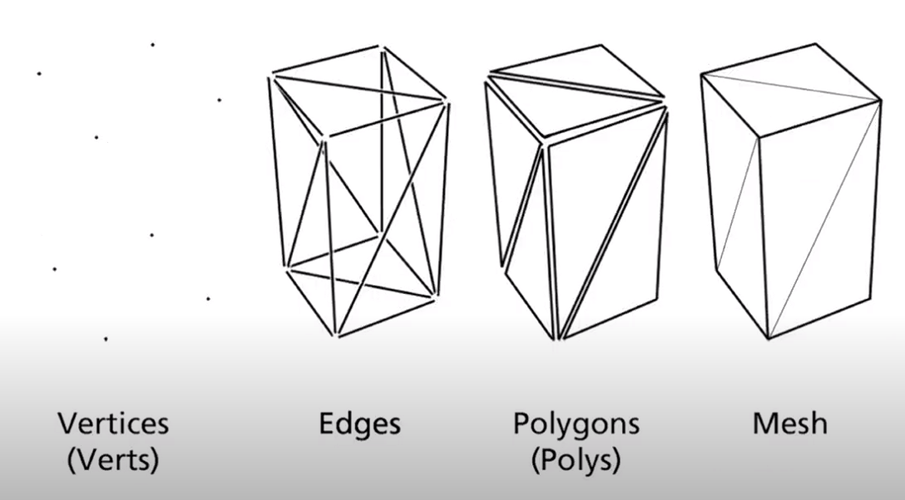

### Local Space / Model Space

메쉬로 이루어진 모델들은 
어떤 메쉬의 원점기준들의 버텍스위치들이 배치되있음
어떤씬공간에 있기 이전에 메쉬자체에 존재해있음.

### World Space
이런메쉬 이런도형을 씬어딘가에 가져다 놓으면 이걸 월드스페이스라고함

Transform.LocalToWorldMatrix => 이게 월드스페이스에 메쉬를 배치해주는 행렬

월드스페이스에 오브젝트, 카메라들이 배치됨.
오브젝트들이 각각각에 배치됨.

메쉬에 있는 버텍스들이 이 LocalToWorldMatrix 와 곱해져서 월드스페이스 공간상으로 변해져서
이동됨

### View Space

오브젝트들과 카메라가 월드스페이스에 위치하고 나면
이걸다시 View Space로 바꿔줘야된다.

카메라기준 공간.

오브젝트를 봐라보는건 카메라를 위해서보는데  
카메라를 기준으로 봐라봐야함

camera.worldToCameraMatrix => 이게 뷰스페이스로 변환해주는 행렬

Z축이 카메라 보는기준 반대로 배치되있는게 정상적인 배치이다

### Projection Space
ViewSpace까지 변환이 되면 Projection Space로 넘어가게됨.  
camera.ProjectionMatrix를 곱해 최종적으로 투영을 거치게된다.  
투영이라는 말은 이걸 실제모니터에서 봐라보는 모습, 실제 우리가 모니터를 봐라보고  
랜더링되는 모습, 공간으로 배치된다보면됨.  

Projection Space에서는 말그대로 투영작업을 하는데
크게 두가지로 있다.
1. 원근투영(Perspective Projection)
흔히 3D에서 랜더링할떄 투영하는 기법이다.
가까이 있는건 크게 보이고 멀리있는건 작게보이는데,
대신 멀리있는건 한꺼번에 많이 보이게됨.  

이런 우리눈에 실제로 작동하는 원근법을 적용해주는게 원근투영

2. 직교투영(Orthographic Projection)
직교투영은 이런원근법을 배제된 투영법
게임쪽에서 쓰일떄는 2D게임에서 쓰임

### 뷰행렬 (View Matric)

뷰공간의 행렬은 기본적으로 카메라의 트랜스폼(행렬)의 역행렬이다.
왜냐하면 오브젝트들이 카메라의 기준으로, 카메라의 상대적인 좌표로 변환이 되야되고
카메라가 중심이 될려면 카메라의 트랜스폼의 역행렬을 적용하면 됨.

유니티에서 보면 카메라를 올렸을때 앞에보이는 게임오브젝트는 반대로 내려가는 형태를 튐

z축은 -붙여준상태로 해줘야된다. 왜냐하면 z축이 카메라가 봐라보는 방향이 아니라 
카메라의 뒤쪽이 Z방향으로 바꿔야되기때문이다. 

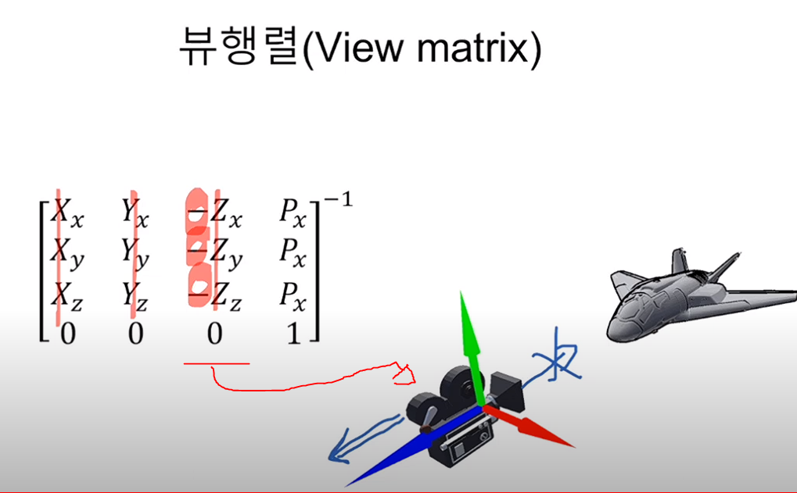

### 26)프로젝션 행렬 part.1

유니티에서 기본적으로 카메라를 다룰때는 프로젝션이 적용된 상태로 작업하고 있다.

유니티 카메라컴포넌트를 보면 투영부분을 고를수 있음

씬상에서 카메라 앞에 네모부터 큰곳의 네모를
ClippingPlanes 의 
Near (0.3 가깝게, 작은값으로) 니어값과 카메라사이의 오브젝트느 그려지지 않음
Far  값보다 멀리있는 오브젝트틑 안보임

####20230227
원근 투영 행렬(Perspective Projection matrix)& NDC(Normalized device coordinates)은

기본적으로 Projection을 다루는 행렬.

카메라기준이 원점이라면 아까 말한 단면이 두개가 존재하고
가까이있는 Near를 줄여서 n,
Far를 줄여서 f

(l, t, -n) (r, t, -n)
(l, b, -n) (r, b, -n)
l => Left 
r => Right
t => Top 
b =>Bottom

-n은 카메라가보는 방향쪽  

피라미드안에 있는 공간을 NDC라고 하는 정육면체 공간으로 변형을 해주는게 원근 투영 행렬이다.

NDC는 좌표공간이 111, -11, 등 1으로만 되있어서 단위화된 장치라고 표현을 한다

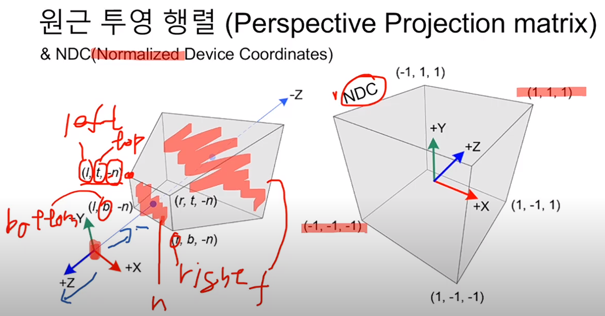

####20230301
그래서 이 원근투영행렬은 조금 복잡함

[2n/r-l 0        r+l/r-l    0         ]
[0      2n/t-b   t+b/t-b    0         ]
[0      0        -f+n/f-n   -2fn/f-n  ]
[0      0        -1         0         ]

이 투영행렬은 뷰스페이스로 변환되고 나서 전환됨.
r+l/r-l = 0
t+b/t-b = 0
l = -3, r = 3
t = 2 ,b = -2
그래서 일반적으론 0이 나온다.

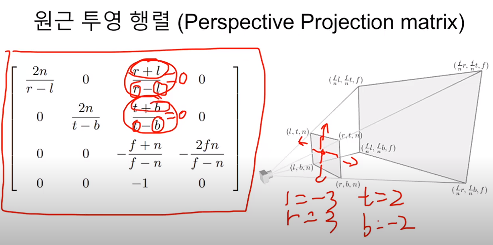

### 27)프로젝션 행렬 part.2

우리가 확인해줘야될곳은 1by1, 2by2, 3by3, 3by4

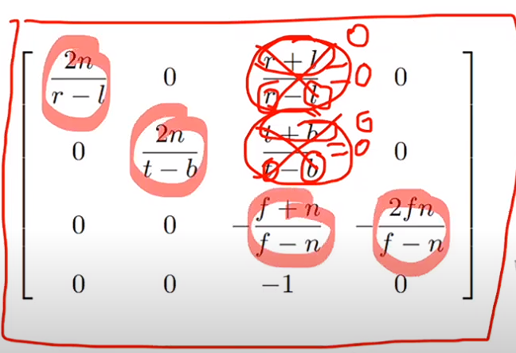

[1 0 0  0][x] [x]
[0 1 0  0][y] [y]
[0 0 a  b][z] [az + b]
[0 0 -1 0][1] [-z]

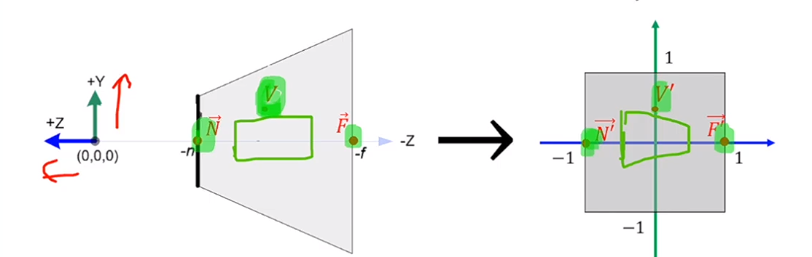

m == 아래의 행렬
[1 0 0  0]
[0 1 0  0]
[0 0 a  b]
[0 0 -1 0]

m * v(0,0,-n,1)  == (0, 0,-an + b, n)
=> (0,0,-an + b/n) 

//n = near = -1 일때
(0,0,-an + b/n) => (0,0,(-a)(-1)/-1)
== (0,0,-1)

m * v(0,0,-f,1) == (0,0,-af+b,f)
=>(0,0,-af+b/n) 

//f = far = 1 일떄
(0,0,-af+b/n) => (0,0,(-a)1+b/1)
== (0,0,1)

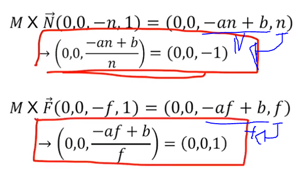

-an + b = -n => an = n + b  

-af + b = f => af = -f + b  

af - an == a(f-n) 로 변환가능  
=> a(f-n) == -f + b - (n + b) == -f -n //b는 사라지고 남음  
a(f-n) == -f - n  
a == -(f + n)/f-n  

a가 행렬 3by3위치에 들어감  

//a는 위에 나온값 a  
b == an - n == n (-(f + n)/f-n)) - n  

//n이 공통적으로 있으니까. 묶기
n(-(f + n)/f-n) - 1) == n(-(f + n)/f-n) - f-n/f-n)  
//공통적으로 보이는걸 묶으면 아래처럼 나옴  
=> b = -2fn/f-n  

b가 행렬 3by4로 들어감  

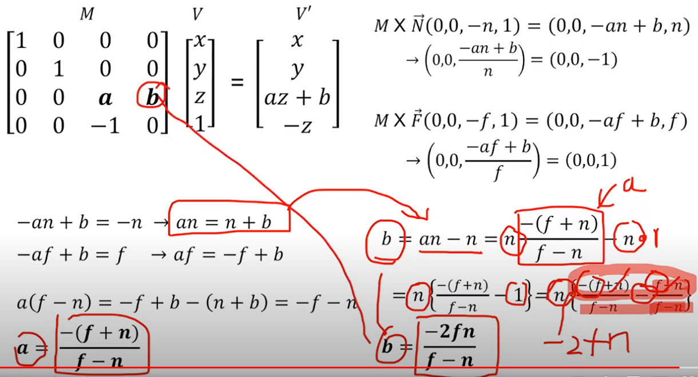

### 28)프로젝션 행렬 part.2

a, b 부분을 구하는 영상

a => x축
b => y축

좌측상단 좌표기준 (0,1,1)

tan == y/x == 기울기

b == 1/ (tan(theta)/2) == 2n/t-b

btan(theta) == 1;

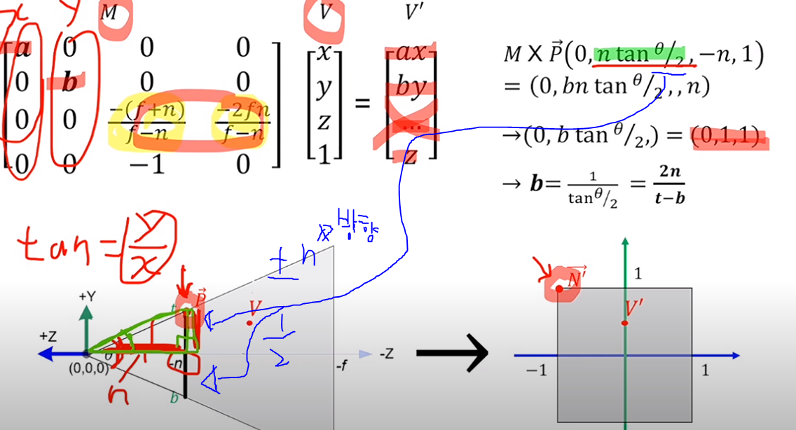

n = width
t = height

tan(t/n) = t-b/2n =

y축 == 2n / t-b; == b (matrix 2by2)
x축 == 2n / r-l == a (matrix 1by1)

투영은 복잡해보이는데 하나하나 따져보면 이렇게 이해할수 있다.

정리하면 
월드 뷰 프로젝션 (WorldViewProjection) 트랜스폼
모델 뷰 프로젝션 (ModelViewProjection) 트랜스폼

모델, 로컬스페이스에서 월드스페이스로 변환해주고
이걸 다시 카메라기준 뷰스페이스 기준으로 변환해주고
그리고 프로젝션(투영)으로 변환해줌

이런 변환 과정을 버텍스 쉐이더에서 수행하고
이런 트랜스폼을 거치고 나서 픽셀쉐이더로 넘어가서 랜더링이되고 쉐이딩이 됨.

MVP WVP
유니티에서 혼합하여 사용함

ClipSpace = NDC 공간안의 포지션

### 29)투영행렬(projection matrix) 조작

####20230302

View Matrix와 Projection Matrix를 유니티에서 코드로 보는 영상

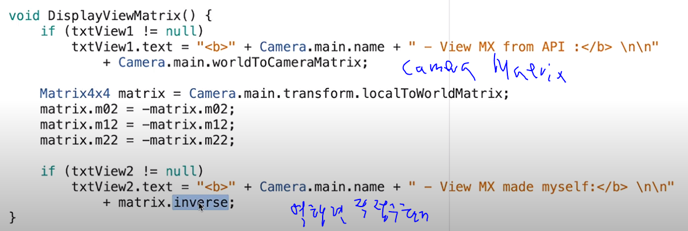
 

같은거 확인
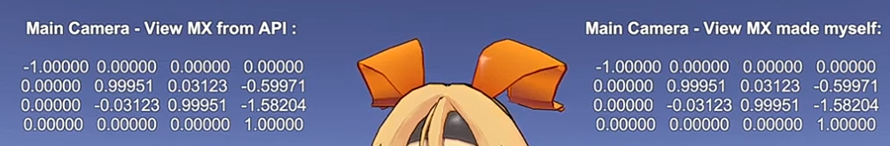

프로젝션 매트릭스를 사용해서 어질어질 흔들리는 카메라 효과를 구현하는 코드
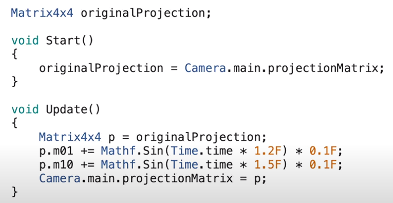

### 30)행렬식(determinant) = 변환의 크기

####20230309

행렬m이 이렇게 되있으면

m = [a b]
    [c d]

m == det(m) == det(a b) == ad - bc (행렬식의 결과)
                  (c d)

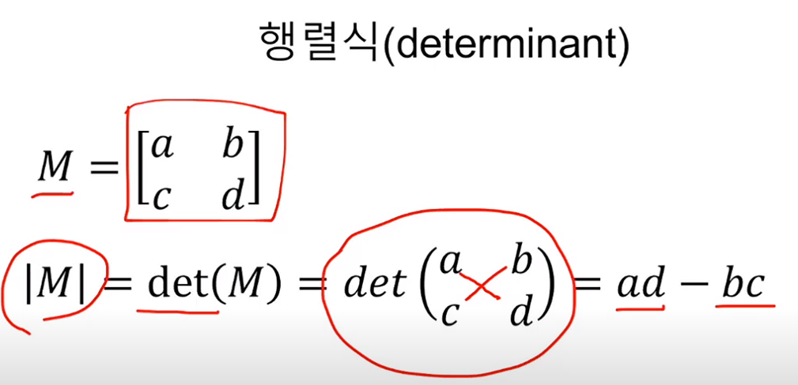

게임에서 특히 그래픽적으로 필요한것은 외적.

행렬을 트랜스폼(변환)으로 다루었는데.  
행렬식은 크기로 봄.  

행렬에 대한 변환량의 크기를 나타낸다.

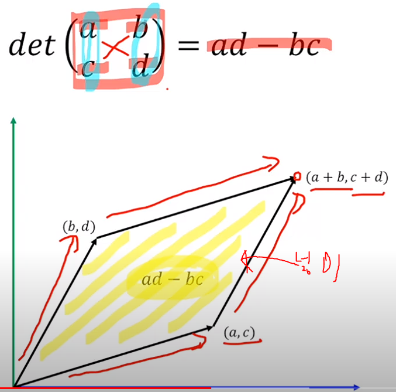

 ad - bc => (a+b)(c+d) - 2bc - bd - ac
         => ac + ad + bc + bd - 2bc - bd - ac

2차원
[a b]
[c d]
=> ad-bc

### 31)벡터의 외적(cross product)의 정의와 특징, 그리고 행렬식

####20230312

영어는 크로스프로덕트.
영단어 크로스에서 유측할수 있듯이

벡터에 외적하면 교차된 벡터가 나오게됨

유니티에서 사용하고 있는 좌표측 화살표를 이해하면 빠를거 같다

y * z = x
z * x = y
x * y = z

외적, 내적같은경우 둘다 벡터의 곱셈인데  
내적같은경우 교환법칙이 성립이 되지만.  
곱하는 순서가 상관없음

외적같은경우 곱하는 순서가 있음.
교환법칙X

서로 곱했을때 나오는벡터의 방향이  
유니티는 왼손법칙을 사용.  
외적나오는 방향도 왼손법칙을 사용.  
서로순환됨  

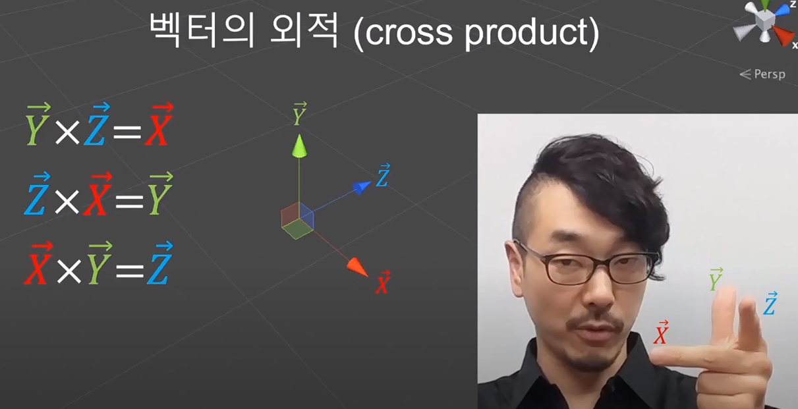

a = (a1,a2,a3)
b = (b1,b2,b3)

a * b = (a2b3 - a3b2, a3b1 - a1b3, a1b2 - a2b1)

a * b = det
[i  j  k ]
[a1 a2 a3]
[b1 b2 b3]

외적의 결과식은 행렬식으로 쉽게 접근가능

두벡터모두에게 직교가됨

####20230313

### 어디에 쓰는지 사용처관련체크

#### 내적은 앞인지 뒤인지에 사용

앞 1  
뒤 -1

#### 외적은 우측인지 좌측인지에 사용(float로 할시)
우측 1
좌측 -1

## 마무리됨.(복습하기)

## 신규 공부 
### 20230325

수포자를 다봣으니 프로젝트를 진행하면서 골때렷던거를 공부해보자

https://youtu.be/nMhMP01m1xo

벡터
크기와 방향을 가지는 물리적 양
화살표로 크기와 방향을 모두나타낸다

 
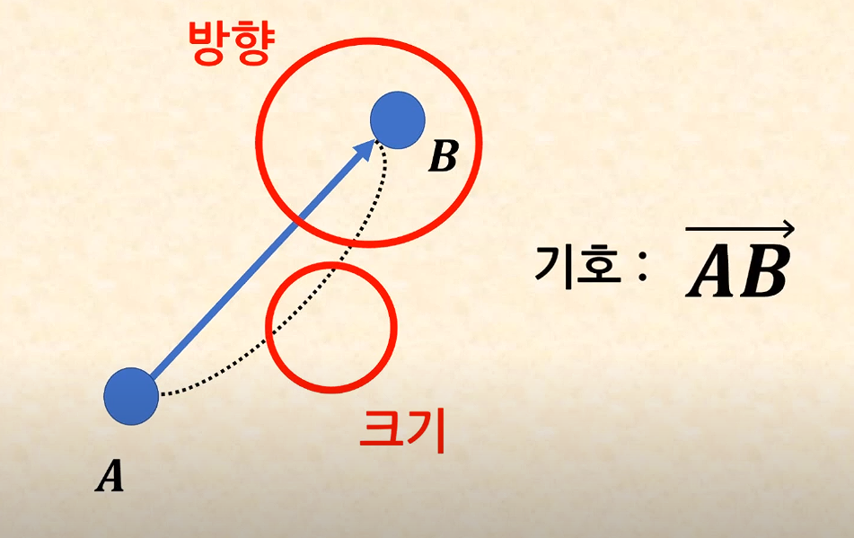

이리저리 생각했을때 제일 간단한 방법을 생각해보자
벡터는 수없이 숫자를 늘릴수 있다
vector2, vector3, .... vector11

제일 작은거로 하자
vector1 => 1개짜리

방향 + 크기 = 타겟좌표 - 현재좌표 

vector1은 즉 숫자한개만 있는 상태다. 이걸 염두해두고 처리하자면
vector1 dir = vector(a) - vector(b);  

vector1을 쉽게 x축만 있다고 보자  
그럼 각 변수에 대입해보자  
a = 1,b = 0;  
1 = 1 - 0;

x축으로 1을 방향과 크기만큼 움직인다  
이제 이상태로 vector2로 적용하자면  
a = vector(2,3), b = vector (1,1)  
1,2 = (2,3) - (1,1)

벡터의 내적(스칼라)

x, y = x*y cos(delta)

x = x1, x2
y = y1, y2 
== (x1y1 + x2y2) cos(delta)

두벡터의 내적으로 벡터사이의 각을 알수 있따
-1 <= cos <= 1 임

# 쿼터니언

https://youtu.be/d4EgbgTm0Bg

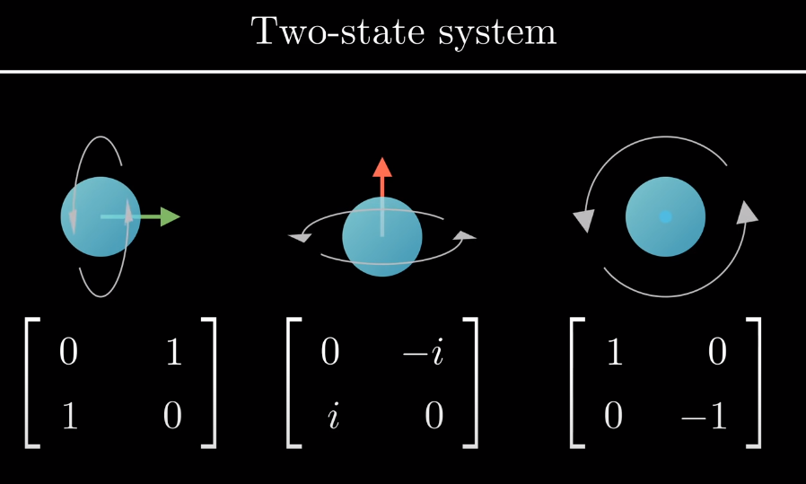

최대 0 ~ 1 구역
i j k

1.00, 0.00i, 0.00j, 0.00k

-=실수  
실제로 존재하는 수 RealNumber  
-=허수  
실제 존재하지 않는 가짜수. imageinary number  
-=복소수
가장넓은 수의 체계이며, 더는 새로운 수를 공부하지 않아요. 수의 체계는 마지막 이죠   
실수와 허수가 섞여 있는 수. 두실수 a,b와 허수단위i 를 이용해서 a+bi 형태의 수를  
만들수 있는데 이게 복소수

https://youtu.be/AAp6ipIMooo

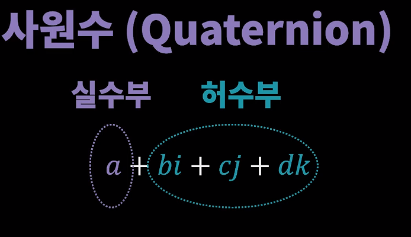

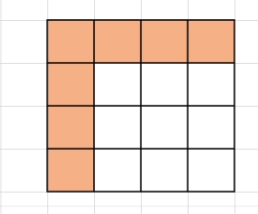

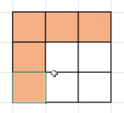

회전이라는건 위치값 이동
회전도 어떤 축에 대한 이동

모든건 단위원에서 비롯된다
단위원은 반지름이 1인 원이다

삼각형의 빗변은 1이다
sin = y 
cos = x

y축을 안건드리면 y축의 회전

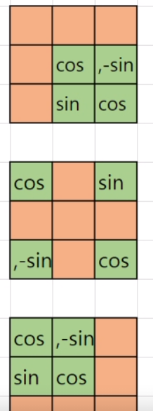

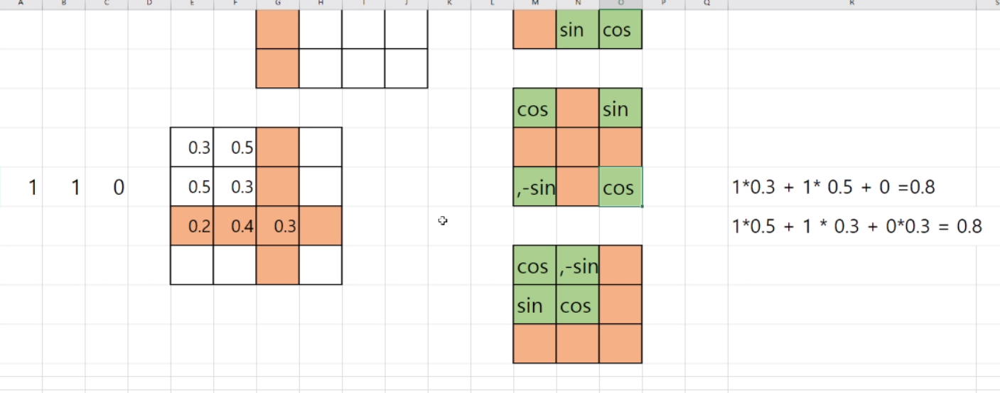

좌표축에 대한 위치떄문에 다이렉트를 사용하는것

