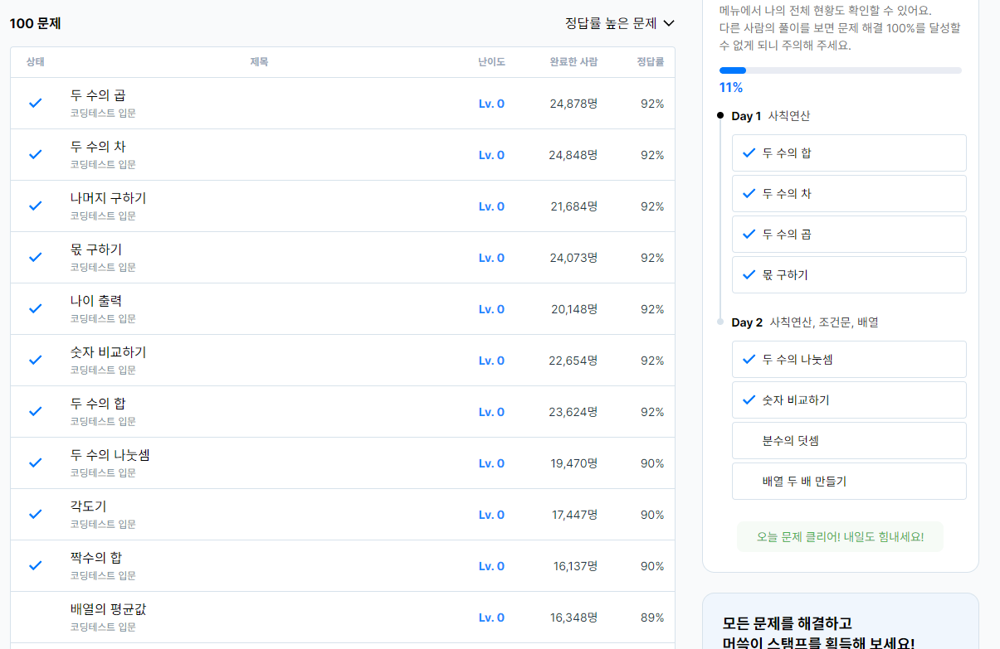
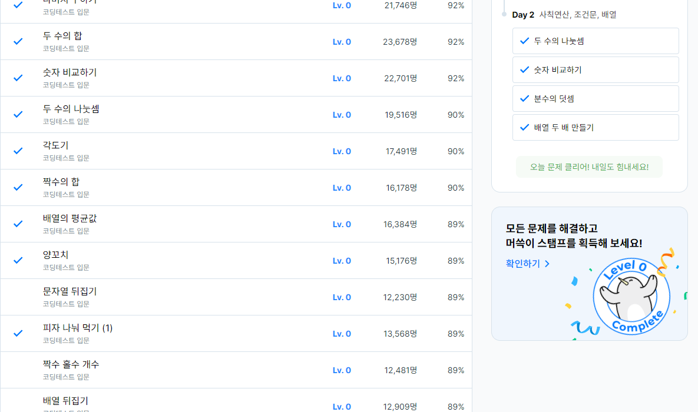
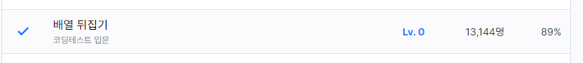
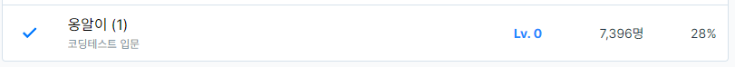
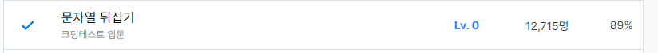
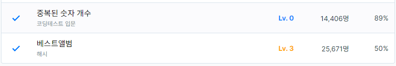
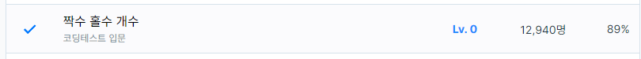

# 알고리즘 및 코테 공부

## 목적  

국비지원 학원 6개월을 다니기로 했다.  
합리적인 이유로는 
1. 자소서 및 자료정리, 포폴제작, C#외의 언어공부등 시간을 벌기 위한 의도
2. 취업트랜드에 맞게 공부
3. 모르는게 있을것에 대한 보완.
4. 회사에 맞게 사람을 변환
5. 체력기르기
6. 사회적인 긴장감을 유지할 환경을 조성

비합리적인 이유로는
1. 학원딱지
2. 게임외에 유니티사용 기업을 갈 확률이 높아진다.
3. 이 실력에 학원갈 이유가 있나?
4. 취업시장이 어덯게 될지 모른다. 3월을 보는중

4년동안 1인개발하다가 좀더 많은 노하우와 커리어가 필요하여 취업을 하기로 결정.
취업을 위한 의도로 최근 취업트랜드에 맞게 공부를 하려함

## 요구사항 & 조사

백준 or 프로그래머스인데 지금은 프로그래머스가 편하니 이걸로 

하루에 한개 이상 하자고 했고 아마 3일마다 1개로 될거 같다고 말하심

목표는 넉넉히 3일에 한개

날짜랑 한것들 적자

20230204//코드도 적을까?

적는게 맞아보이는데 찾기 귀찮

---

#### 20230204

#### 20230205

#### 20230207

#### 20230209

#### 20230210