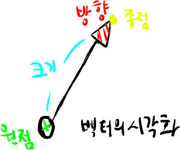

아르고님한테 받은 책중 `좋은 게임을 만드는 핵심원리 게임수학과물리책`을 나눔받았다.

얼른 보고 메타몽님한테 택배로 보내주기

# 책의 주요특성

게임프로그래밍에 필요한 가장 기초적인 수학과 물리를 다룬다

# 1.벡터

힘, 모멘트(회전력), 변위, 속도, 가속도  
크기와 방향을 갖는 물리적 요소들을 수학적으로 표현하기 위해서 벡터라는 개념을 도입  
벡터란 크기와 방향을 나타내는 수학적인 도구이다  

화살표의 길이가 벡터의 크기를 표현.  
화살표의 머리가 방향을 나타냄  

## 스칼라
크기만 나타낼때는 스칼라(Scalar)
스칼라는 크기 or 값만 표시할때 사용
벡터를 설명할떄  언급한 크기라는것자체가 스칼라

### 동등벡터 
각각의 벡터가 시작점은 다르지만 크기오하 방향이 모두같은 벡터

## 벡터 == [Vx, Vy] == 2차원백터

(2차원, 3차원동일)
가고하자 하는방향 = 상대방위치벡터 - 자기자신위치벡터

## 벡터의 크기와 단위벡터

### 벡터
||V|| == 벡터의 크기라는 기호. 노옴(Norm)
삼각형으로 보면 빗변이 벡터의 크기or길이 (피타고라스)
루트 == 제곱근

#### 2차원
벡터의 크기or길이 = 루트(넓이제곱 + 높이제곱) == ||V|| = Sqrt(Pow(x,2), Pow(y,2))

#### 3차원
벡터의 크기or길이 = 루트(좌우 + 위아래, 전후방) == ||V|| = Sqrt(Pow(x,2), Pow(y,2), Pow(z,2))

### 단위벡터
단위벡터 == 방향만을 나타내는 벡터

벡터 == 크기와 방향을 갖는 요소

단위벡터는 이름에서 볼수 있듯이 크기는 단위, 즉 1이다.  
U가 단위벡터라고 다음과 같은 말이된다

1 = sqrt(pow(Ux,2), pow(Uy,2))

크기가 1인 벡터는 방향ㅇ르 표현하는데 융용하게 쓰이며 컴퓨터 그래픽스에서 광원의 방향, 
평면의 법선 방향, 카메라의 방향등 방향을 나타낼떄 사용된다.

크기가 1이 아닌 벡터를 단위벡터로 만들어주는걸 `정규화(Normalization)`라고 하며,
벡터를 자신의 크기로 나누어 줌으로 써얻을수 있다.

vector V = new vector(x,y);

U = V/||V|| ==  (1 / sqrt(pow(Vx,2),pow(Vy,2))) * V

#### 반대
V =  ||V|| U = (sqrt(pow(vx,2),pow(vy,2)))*U

## 정규화과정은 매번 이해가 잘안되네

### 길이처리
float sqrt(x*x + y*y + z*z);

### 단위처리
float length = GetLength();
vector (x/ length, y/length, z/length);

### 벡터의 곱셈은 두종류
#### 내적(스칼라(Scalar))

결과값이 스칼라, 스칼라곱(Scalar Product) or 점곱(DotProduct) 이라고 부름  
내적은 벡터의 방향관계를 얻는 도구로 사용되기떄문에 컴퓨터 그래픽스에서 매우 빈번히 사용됨.

#### 각벡터의 성분간의 곲을 모두 더한 스칼라값이 벡터A,B의 내적이다.

벡터A = B가 같으면 0 이 나오므로 Cos(delta) = 1 이 나옴
0~180
A * B == (||A|| ||B||)cos(delta)

(0제곱은 1이 나옴)
Why => 
3 * 0 == 0 => 구할수 없음
3 * 1 == 3
3 * 2 == 9

3(0) == 1
3(1) == 3
3(2) == 9

## 내적응용
1) 방향
A가 자기자신의 방향(고정), B가 상대방의 위치(움직임)를 내적하면

1 == 전방  
0 == 수직  
-1 == 후방  

2) 벡터의 투영
하나의 벡터A를 두개의 단위벡터성분으로 분해하든지 
다른벡터 B로 투명해야할필요가 생기곤한다.

하나의 벡터를 두개의 단위벡터성분으로 분해하는 개념을 설명하고 있다.

벡터A와 단위벡터i,j 간에 각각 내적을 취하여 각방향으로 분해된 벡터의 크기를 
구한후 단위벡터를 곱해주면된다.  
(뭔뜻이여)

#### 외적(Cross)
벡터의 외적은 벡터곱셈의 또 다른 형태다. 벡터의 내적이 두벡터간의 사이값 관계를  
나타내는 스칼라임에 비해 벡터의 외적은 두벡터에 수직한 벡터의 결과값으로 갖음.
크로스곱(Cross Projuct)or 벡터곱(Vector Product)

교환법칙이 성립되지 않으므로 
A와 B의 순서에 주의해야됨

## 외적 응용
1) 표면의 법선벡터 계산
법선벡터(노말벡터) == 수직벡터
주로 평면이나 곡면등의 표면에 수직한 벡터를 법선벡터

법선 벡터를 설명할려면 접선벡터도 알아야된다. 
접선벡터는 어떤표면에 접한 벡터다. 

(그럼 무조건 세개의 정점이 필요하다)
점 A의 기준으로 점B,C에 대한 벡터를 각각 U, V.
접선벡터 U, V가 주어질떄 그 점에서 법선 벡터N은 U와V의 외적이다.
N = U * V

2) 삼각형의 면적계산
A * B (||A|| ||B|| sin(delta)) E
(E = A * B방향의 단위벡터)

법선벡터 N의 크기는 U와 V로 구성되는 평행사변형의 넓이(밑변 * 높이 = 넓이)

## 2. 행렬
행렬 : 벡터의 확장

행렬이란 2차원으로 배열된 순서 쌍을 말함
(1by1 2by1)
[a11 a12 a13 a14]  
[a21 a22 a23 a24]  
[a31 a32 a33 a34]  
[a41 a42 a43 a44]  

m행 n열  
개행, 열 == 렬

#### 정방행렬
행과 열의 수가 같은 행렬

#### 대각행렬, 단위행렬
대각행렬 i와 j가 같은 원소를 대각선 성분이라고 하는데
정방행렬중에서 와 같이 대각선을 제외한 모든성분이 0인 특별한 형태
[a11 0 0  0]  
[0 a22 0  0]  
[0  0 a33 0]  
[0  0  0 a44]  

단위행렬은 여기서 대각선 성분의 값이 1로 모두가 같으면 이걸 단위행렬이라고 함  
[1 0 0 0]  
[0 1 0 0]  
[0 0 1 0]  
[0 0 0 1]  

#### 전치행렬
행을 열로 자리바꿈하거나 열을 행으로 자리바꿈한것.
A행렬이  
[2 7 -4]  
[1 6 -1]  
이면 전치행렬일 경우  
[2 1]  
[7 6]  
[-4 -1]  

### 행렬 연산
#### 행렬덧셈
제약조건 == 더해지는 두행렬의 차원이 동일해야됨.
(m*n) + (m*n) => (m*n)
[1 2] + [1 2] = [2 4]
[3 4]	[3 4]	[6 8]

#### 행렬뺄셈
제약조건 == 더해지는 두행렬의 차원이 동일해야됨.
(m*n) - (m*n) => (m*n)
[1 2] - [1 2] = [0 0]
[3 4]	[3 4]	[0 0]

#### 행렬곱셈
행렬연산에서 자주사용되는것중 하나가 행렬의 곱셈

벡터의 내적 == 차원이 같아야 연산이 가능
행렬의 곱셉을 하기전에 왼쪽 행렬의 열의 수가 오른쪽 행렬의 수와 동일한지 체크하기
=> A와 B행렬의 열의 수가 동일한지체크
(m*n) - (n*p) => (m*p) (곱셈을 하기전에 행렬 A B기 같은지 확인하는 것)
(2*3) - (3*2) = 2*2 => `안쪽부분이 같은지 체크하기가 관건`
[1 2 3] * [1 2] =
[3 4 5]	  [3 4]	
		  [3 5]
[1+6+9 2+8+15]
[3+12+15 6+16+25]

[16 25]
[30 47]

#### 행렬과 스칼라와 곱
벡터에 스칼라를 곱한적이 있었다. 이때 벡터의 각 성분에 스칼라값을 
곱하는것으로 그결과가 표시됫는데
=> vector(2,3) * 2 == vector(4,6)

행렬역시 이와 비슷하게 됨
k = 스칼라

a = [1 2]
	[3 4]

3a = [3 6]
	 [9 12]

#### 행렬의 연산법칙
A,B,C 행렬
I 단위행렬
0 영행렬
K, I는 스칼라

1)덧셈법칙
1. a+b == b+a
2. (a+b)+c == a+(b+c)
3. a+0 == 0+a == a
4. a+(-a) == 0

2)스칼라의 곱법칙
1. (k+i)a == ka+ia
2. k(a+b) == ka+kb
3. (ki)a == k(ia)
4. (-1)a == -a
5. 0a == 0

3)곱셈 법칙
1. ab != ba  (실수나 유리수는 가능하지만. 행렬은 불가능)
2. a(bc) == (ab)c
3. a(b+-c) == ab+ac
4. (a+-b)c == ac+-bc
5. ai == ia == a
6. k(ab) == (ka)b == a(kb)
7. 정방행렬 A에 대하여  
a(0제곱) == i
a(1제곱) == a
a(n+1제곱) == a(n제곱)a
a(m제곱)a(n제곱) == a(m+n제곱)

※주의해야될건 곱셈의 첫번쨰 규칙이다.

#### 행렬식

판별식(determinant)

행렬식은 모든 행렬에 대해 존재하는것이 아니라 행과 열의 수가 같은 정방행렬에서만 구할수 있으며
우리는 정방행렬 A에 대한 행렬식을 다음과 같이 표시한다.
detA == det(A) == |A|

행렬식을 계산하기 위해 필요한 두가지 개념을 알아보자
1. 소행렬식

2. 여인자(cofactor)

음.. 쉽게 말하면 3by3 행렬일때

a11a22a33 + a12a23a31 + a13a21a32 -a11a23a31 -a12a21a33 -a13a22a31 == 3by3 정방행렬의 행렬식

\ 이방향으로 곱하고 더하기 3번
/ 이방향으로 곱하고 빼기 3번

※ 사다리꼴의 면적
(밑변의 길이 + 윗변의길이) * 높이 / 2 == 사다리꼴의 면적

#### 역행렬(inverse matrix)
역행렬은 정방행렬에 대해서만 존재하고 다음조건을 만족시키는 행렬을 의미한다.  
aa(-1제곱) == a(-1제곱)a == i  

그러나 정방행렬이라고 해서 모두 역행렬이 존재하는것은 아니다.  
역행렬이 존재하는 행렬 == 가역(invertible)행렬  
역행렬이 존재하지 않는 행렬 == 특이(singular) 행렬  

## 3. 변환(트랜스폼인듯)
변환은 게임그래픽스에서 2가지목적으로 사용된다.  
1. 정점의 위치벡터를 이동  
2. 방향벡터의 자세를 변화시키는데에 사용 (각도)  

게임에서 변환은 공간상에서 물체의 위치 방향 이동등을 표현하기 위해 사용되는 핵심적인 기능을 수행한다.  

이동변환 : 한점의 위치만 이동시키는 변환  
자세&회전변환 : 어떤선이나 방향을 이동시키는것(각도)  

### 좌표계(coordinates)
좌표계는 하나의 기준이다. 변환을 수학적으로 설명하기 위해서는 기준인 좌표계가 있어야하며,  
이좌표계를 통한 좌표로 변환을 서술해야한다.

#### 직교좌표계
가장 일반적으로 사용하는 좌표계.  
3개의 실수값으로 좌표를 표현

#### 원기둥좌표계
원기둥에서 좌표계를 표현하는 방법

※공식
직교좌표계 
x, y, z
원기둥좌표계
rcos(theta), rsin(theta), z

#### 구면좌표계
지구본에서 쓰는 그거

#### 이동 변환
기본적으로 하나의 좌표를 이동시키는것
물체의 방향은 변환하지 않는것.

#### 회전 변환
이동변환은 각 좌표축에 대한 이동크기를 더해줌으로써 수행되는데 비해  
회전 변환은 주어진 각도만큼 `회전축`을 기준으로 회전하는 변환이다.

※회전행렬
[cos -sin]
[sin  cos]

※2차원 평면회전  
[x] = [cos -sin][x]  
[y]	= [sin  cos][y]	

※2차원평면회전의 3차원확장  
매트릭스가 한개더 늘어난다  
3by3

xy평면상에서 z축기준으로 회전  

[cos -sin 0]  
[sin  cos 0]  
[ 0    0  1]  

xz평면상에서 y축기준으로 회전  

[cos   0 sin]  
[0     1  0 ]  
[-sin  0 cos]  

yz평면상에서 x축기준으로 회전  

[1  0    0 ]  
[0 cos -sin]  
[0 sin  cos]  

※ 주의해야될거  
축기준 행렬은 단위행렬로 대체됨
y축기준일시 회전행렬이 뒤집힘(전치행렬이라고 봐야되나?)

#### 3차원 공간 회전
##### 1) 변환의 연결
회전 변환 행렬을 서로 곱하면 원하는 회전 변환을 수행할수 있다  
3차원 좌표 vector를 x축 기준 30도, y축기준으로 60도 회전시킬려면  

ry(60) rx(30)  =>

[cos60  0 sin60][1  0      0   ][vectorx]  
[0      1  0   ][0 cos30 -sin30][vectory]  
[-sin60 0 cos60][0 sin30  cos30][vectorz]  

※ 주의해야될거 
x축으로 30도 회전하면 좌표축 전체가 이동하기 때문에 y축의 위치도 바뀐다는 점이다.  
따라서 y축 기준으로 60 회전하는 회전축은 x축에 대한 회전변환이 반영된 좌표축을 기준으로 수행된다.  
따라서 회전 변환행렬을 곱하는 순서에 따라 변환된결과가 다르다는것을 명심하기.

##### 2) 오일러변환
오일러 변환(The Euler Transfrom)은 회전 변환 행렬이나 좌표축의 자세를 표현하는 매우 직관적인 방법이다.  
x,y,z축을 각각 회전축으로 했을때 각회전축에 대한 회전각으로 3차원 공간회전 변환행렬을 정의한다.  

오일러변환에는 여러가지 방법이 있지만, 이책에서 가장 많이 사용되는 ZYX 오일러변환에 대해 이야기하면
ZYX 오일러변환은 z축으로 a, y축으로 b, x축으로 c만큼 회전시킨 각각의 회전행렬을 곱함으로서 이루어지기때문에  
붙여진 이름이다.

[cosa -sina 0] [cosb   0 sinb] [1  0    0 ]
[sina  cosa 0] [0      1  0  ] [0 cosc -sinc]
[ 0    0    1] [-sinb  0 cosb] [0 sinc  cosc]

#### 회전행렬의 성질

회전행렬끼리의 곱은 회전행렬
RT(theta) = R-1(theta)

### 크기변환

지금까지 설명한 이동변환과 회전 변환은 위치와 방향만 바뀔뿐 기하적 형상의 길이나 사잇각등은 변화하지않는다.

이동변환, 회전변환은 각 사각형의 꼭지점간 거리가 일정하게 유지되고 모서리간 각도가 직각으로 변함이 없었다.
이러한 변환을 강체변환(rigid body transformation)

여기서 설명할 변환은 기하적 형상의 길이와 사잇각이 유지되지 않는 비강체 변환의 일종인 크기변환.

크기변환행렬
a => x축으로 방향으로 a배
b => y축으로 방향으로 b배
c => z축으로 방향으로 c배

[a  0  0][x]    [ax]
[0  b  0][y] =  [by]
[0  0  c][z]    [cz]

### 동차 좌표계

세개의 변환을 한꺼번에 표현할수 있는 동차좌표계(homogenoues coordinate)

P, Q 가 있고 점인지 벡터인지 알려고 w값에 따라 변경

w = 1 => 점
p	[px]
	[py]
	[pz]
	[w]

v	[vx]
	[vy]
	[vz]
	[0]

w = 0 => 벡터

이동행렬 = 더하기
회전행렬 = 곱하기
크기행렬 = 곱하기

### 좌표계의 변환
1. 월드좌표계와 로컬좌표계  
3d프로그래밍에서는 좌표계를 기준으로 변환을 수행한다.  
하나의 좌표계에서 여러물체를 표현하는것보다는 여러개의 좌표계상에서 각각의 물체를 표현하는게 더 편리하기 때문이다.  

2. 좌표계의 변환  
※이동행렬  
[1  0  0 dx]  
[0  1  0 dy]  
[0  0  1 dz]  
[0  0  0 1 ] 

※동차 변환행렬  

3번을 1번으로 변환할려는 행렬. 2번행렬이 동차 변환행렬이다.
2번행렬 == G행렬

[apx]   [1  0  0 dx][bpx]  
[apy] = [0  1  0 dy][bpy]  
[apz]   [0  0  1 dz][bpz]  
[1]     [0  0  0 1 ][1]  

1번		2번			3번  

아무런변환도 수행되지 않는 다음과 같은 행렬을 단위 행렬이라고 한다.  
이동행렬은 동차 변환행렬의 한 경우이다.  

동차 좌표계에서 표현한 회전 변환의 경우, 순수회전이므로 동차 변환행렬의 이동크기는 (x,y,z) 0이 된다.  

※변환의 연결
지금까지 설명한 이동과 회전의 기본변환을 곱해서 여러 변환들을 생성할수 있다.  

지금까지 설명한 내용들은 최종적으로 동차변환을 설명하기 위한것이다.  
4x4행렬의 동차변환을 기본변환행렬로 사용된다.

## 4. 사원수

사원수란 하나의 스칼라와 하나의 3차원벡터를 하나로 묶어서 4개의 요소로 구성된 복소수(complex number)의 일종이다.  
4개의 구성요소를 갖고 있다. 하나는 스칼라, 나머지 세개는 3차원벡터를 구성.

쿼터니언 == (sq, vq) == (w,a,b,c)

스칼라 == w

#### 사원수의 연산  
사원수는 벡터의 확장 개념이므로 벡터연산에 사용했던 일반적인 대수법칙이 그대로 적용됨

1. 사원수의 덧셈  
벡터의 덧셈처럼 각각의 요소를 더하면 됨

2. 사원수의 뺄셈
각각의 요소를 빼면 됨

3. 사원수의 스칼라 곱
크기를 곱하는거니 
사원수의 각요소에다 스칼라를 곱하기

4. 사원수의 곱셈
사원수는 공간의 회전변환을 표현하는데 사용한다고 여러번 이야기했다.  
회전변환시 변환의 연결은 여러개의 회전변환행렬을 곱함으로서 얻을수 있다.  

공간회전변환을 표현하는 사원수 또한 곱셈으로서 변환의 연결이 수행된다.  
사원수를 이용한 변환의 연결 또한 회전 변환 행렬을 통한 변환 연결과 마찬가지로  
곱하는 순서가 매우중요하며, 곱셈의 교환 법칙이 성립하지 않는다.  

사원수가 복소수의 일종이라고 했는데, 사원수의 곱셈은 복소수의 성질을 이용해서 수행된다.

ij=k	ij=k	ki=j
ji=-k	kj=-i	ik=j
i^2=-1	j^2=-1	k^2=-1

여기서 첫째줄과 둘째줄은 벡터의 외적에서 i,j,k의 관계와 유사하다.

따라서 전개법칙을 적용하여 사원수의 곱셈을 정리하면 다음과 같다  
pq = p(d + ai + bj + ck) * q(d + ai + bj + ck)

5. 사원수의 교환, 결합법칙
덧셈의 교환법칙 성립  
p + q = q + p  

덧셈의 결합법칙 성립  
(p + q ) + r = p + (q + r)  

스칼라곱 교환법칙 성립
Sq = qS

곱셈의 교환법칙이 성립하지않음.
pq != qp

6. 공액 사원수  
사원수는 복소수의 일종이며, 스칼라부분이 실수부(realPart)
벡터부분인 i,j,k 부분이 허수부(imaginary part)이다.
즉 사원수의 벡터부분 부호를 반대로 해준것이 공액 사원수이다.
(뭔가 이해하기 으렵다)

7. 사원수의 크기(단위사원수)  
사원수또한 벡터처럼 크기를 갖음. 사원수의 크기 공식
d^2 + a^2 + b^2 + c^2 = p^2

8. 사원수의 역수  
-1 곱하면 됨

#### 3. 사원수변환

이제 그 복잡한 수식이 게임에서 어덯게 사용되는지 알아보자.  
짜증나기까지 하는 복잡한 사원수에 대해서 알아본것은 어디서 잘난척하려는게   
아니라 우리가 만드는게임에 적용하기 위함이다.  

사원수는 공간상의 임의의 회전변환을 나타내기 위해 유용하게 사용된다.  
사원수의 변환은 다음과 같은 단위 사원수를 통해서 이루어진다.

q = q + qi + qj + qk  
=cos(theta/2) + E*sin(theta/2) = Sq + Vq  

벡터E는 회전축의 단위방향 벡터이다.
theta는 회전각이다.

※ 여기서 잠깐 (단위사원수)
공간상의 임의의 회전축을 표현하는 회전축의 방향벡터는 단위벡터로 지정해야 
cos(theta/2) + Esin(theta/2)가 단위사원수가 된다.

e가 단위벡터이므로 ex^2 + ey^2  + ez^2  = 1 이 된다.

벡터r을 회전축 단위방향벡터 e에 대해서 theta만큼의 회전각으로 공간회전시킨 벡터r`은
다음과 같이 단위 사운수 q^를 통해 얻을수 있다.

사원수변환식 : r` = q^ r q(^-1)

변환을 연결할때 사원수는 행렬표현 방법에 비해서 장접을 갖는다.  
두 사원수의 곱셈에는 16번의 스칼라 곱셈과 덧셈이 수행되지만,  
3x3회전 변환행렬 두개를 곱할경우에는 총 27번의 연산이 필요하기 때문에  
사원수 곱셈을 통한 회전 변환의 표현이 계산속도가 더 빠르다.  
또한 회전변환을 행렬로 표현하는데 사용되는 오일러변환은 한축의 각도가 90도가 되면  
자유도를 잃어버리는 짐발락이라는 현상이 발생하여 회전이 부드럽지못하게 된다.  
이때 사원수 변환을 사용하면 공간상의 임의의 축에 대한 회전이기 때문에 오일러변환의 문제가 발생하지않는다.  

#### 4. 사원수변환의 행렬표현

사원수 변환을 사용하면 4개의 요소로 이루어진 사원수만을 이용하여 임의의 회전축에 대한 
회전변환을 효율적으로 표현할 수 있지만, 우리가 게임프로그래밍에 사용하는 Direct3D나 OpenGL 
같은 3D 그래픽 API 에서는 사원수를 직접적으로 지원하지 않는다.
3D 그래픽API에서 기본적으로 지원하는 변환은 행렬변환이기 때문에 게임에 사원수변환을 적용할려면
 최종적으로 행렬의 형태로 변환해줘야 한다.

## 5. 기하학

## 6. 카매라

## 7. 조명

## 8. 고급랜더링

## 9. 가시성판단

## 10. 다각형기법

## 11. 운동학

## 12. 동력학

## 13. 발사체

## 14. 길찾기