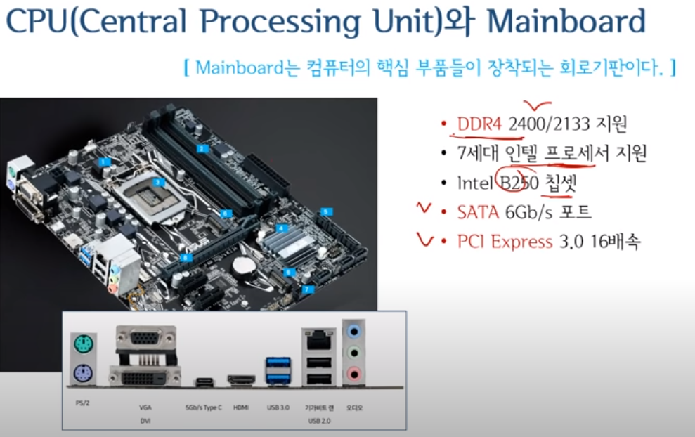
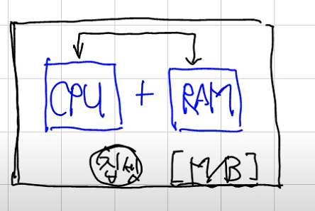
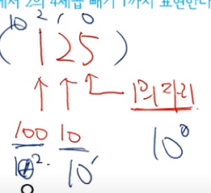
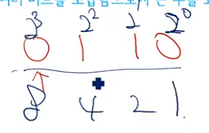
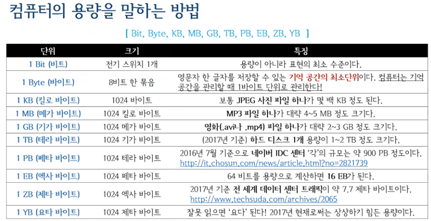
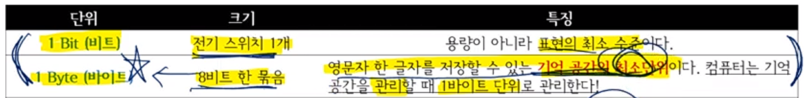

# CS 공부

## 목적  

국비지원 학원 6개월을 다니기로 했다.  
합리적인 이유로는 
1. 자소서 및 자료정리, 포폴제작, C#외의 언어공부등 시간을 벌기 위한 의도
2. 취업트랜드에 맞게 공부
3. 모르는게 있을것에 대한 보완.
4. 회사에 맞게 사람을 변환
5. 체력기르기
6. 사회적인 긴장감을 유지할 환경을 조성

비합리적인 이유로는
1. 학원딱지
2. 게임외에 유니티사용 기업을 갈 확률이 높아진다.
3. 이 실력에 학원갈 이유가 있나?
4. 취업시장이 어덯게 될지 모른다. 3월을 보는중

4년동안 1인개발하다가 좀더 많은 노하우와 커리어가 필요하여 취업을 하기로 결정.
취업을 위한 의도로 최근 취업트랜드에 맞게 공부를 하려함

## 요구사항 & 조사

전공서적책을 꺼내서 일일히 보는것보다는 필요한것만 추출

넓고 얕게 배우는 컴퓨터구조, 자료구조와 알고리즘, 프로그래밍, 운영체제
https://www.youtube.com/playlist?list=PLXvgR_grOs1BQCziQ_MpM877BdBxwbMzA

---

#### 20230203
7시간동안 핵심만 배울수 있게, 인생에 바보같은 질문은 없습니다.  

IT하면서 필요한 최소한을 딱딱 모이놓음

1. 컴퓨터관련 기본 용어 정리
입문 관련 용어
용어 정리할때 다나와가 제일 좋아보인다.

컴퓨터구조다 하면 CPU를 말하는것이다  

다나와 용어사전이 굉장히 잘해났다.
다나와에 있는 말들만 이해하면 끝난다.
다나와를 잘 봐라

컴퓨터는 크게 A.소프트웨어 B.하드웨어로 나누어져있다.
컴퓨터를 이루는 가장중요한 3가지요소는 소프트웨어, 하드웨어, 응용프로그램으로 이루어져있다.

A.소프트웨어 
A-1. 응용
A-2 .시스템
B.하드웨어

CPU (Central Process Unit)와 메인보드

CPU는 컴퓨터의 정체성을 결정하는 핵심 부품이다.
CPU는 전기도 많이 쓰고 열도 많이남
열이 많이나는걸 식혀주기 위해
쿨러라고 필요함

장착하는 구역을 슬롯이라고 부름

CPU가 들어가는 구역은 소켓이라고 함

전기를 꽂는 구역

DDR : 램메모
칩셋 : 입출력과 관련된 브릿지칩셋
알류미늄로 되있는 칩셋들이 입출력 칩셋

RAM (Random Access Memory)
CPU의 연산을 돕는 1등 공신(주기억장치)으로 가장 중요한 부품 중 하나다.
전원을 끄면 내용이 사라진다. 
자료라는게 Ram이라는곳으로 가져온뒤 연산
2400MHZ = 속도
8GB = 용량

MainBoard
컴퓨터의 핵심부품들이 장착되는 회로기판
컴퓨터부품에서 제일큰애가 메인보드
SATA = 외부기기 연결
PCI Express = 외부기기 연결
CPU와 Ram 사이에서 정보를 주거니 받거니 할때 메인보드에 또다른 칩셋에서 처리

HDD와 SSD (feat.USB Disk)(보조)
일시적인 기억을 장기 기억으로 전환할때 필요한 장치이다.
전원을 꺼도 내용이 사라지지 않는다.

정보를 RAM쪽에 보내고 RAM에 있는걸 CPU가 가져가서 연산을 함

SSD는 NAND Flash Memory를 이용하여 구조적으로 달라지고 속도가 매우 빠름

RPM 회전속도 = 회전이 빨라질수록 입출력(저장)I/O가 빨라질것이다.

하드디스크들의 인터페이스들은 SATA들이다.

컴퓨터 속의 모든정보는 숫자이다.

주변기기 연결 인터페이스 
USB D-Sub DVI HDMI 등등
컴퓨터에 연결되는 모든장치들을 주변기기라

### 컴퓨터하면 대략 이정도가 컴퓨터

### 20230204

정리
컴퓨터부품으로 제일 큰 부품은 메인보드이다

메인보드위에는 CPU를 올리고 주 기억장치인RAM을
올린다.

CPU와 RAM에 있는 정보를 주고받을때 메인보드내에
칩셋에서 처리해준다

메인보드와 보조기억장치를 이어줄때 
SATA로 연결된다.

컴퓨터라고 하면 컴퓨터속의 모든정보는
모조리 숫자이다.

숫자로 되있는 정보를 CPU에 들어와서 연산을한다

보조기억장치(1)에서 가져와서
주기억장치(2)로 가져온후 CPU(3)에서 연사을 했더니

소리를 내는 데이터면
사운드카드로 데이터를 보내서
스피커를 울리게함

VGA 비디오카드 => 모니터(시각화)
GPU 그래픽연산에 대한 장치가 있음

### 핵심은 CPU RAM 보조기억장치 쪽이다

1비트에서 진법변환까지

컴퓨터의 구조를 공부를 할려면 CPU의 구조를 공부해야되는데
반드시 알아야 될 2가지
1. 1비트를 알아야된다. (1bit)
2. 진법변환을 알아야된다.

1비트란 전기스위치 1개를 의미한다
전기가 흐르는 on상태는 1
전기가 흐르지 않는 Off상태는 0이다.

전기스위치 하나가 1비트이다.

한 위치에 올수 있는 숫자가 0~1사이밖에 안되는
2가지경우만 있는데 이렇게 2진수로 표현

0110 네자리숫자

이진수를 십진수로 바꾸는걸 어렵지 않다. 이러한걸 
진법 변환이라고 한다

십집법

이진법

이렇게 변환 계산하여 이해할수 있게 한다.

경우의 수가 2가지인데 이걸 조합하여
2의 4제곱만큼 경우의 수가 생긴다.

위같은경우 4비트로 말하고
16가지 경우의수가 가능하다

### 1bit와 4GV (중요외우기)
여러비트를 조합함으로써 큰수를 표현할수 있다.
예를 들어 4비트는 0에서 2의4제곱 빼기 1까지 표현한다.
(16가지의 경우수를 가지며 0~15까지 있다)

8개 비트를 하나로 묶어 1바이트(Byte)라 한다
1바이트는 영문자 한 글자가 저장될수 있는 메모리크기다.
한글 한글자를 저장할려면 2바이트가 필요하다
2의 10 제곱은 1024이다
2의 32 제곱은 4294967296 바이트 이다. 4GB(기가바이트)
2의 32 제곱은 32Bit를 의미한다. 즉 32비트 구조의 한계용량은 4GB이다
4비트의 16가지, 8비트는 256가지, 16비트는 65536 이다. 
#### 일단 이렇게 외우자

단위가 올라갈때 무게같은 경우 천단위로 끓는다. (1kg -> 1000g)
컴퓨터는 1024단위이다.

2가지는 무조건 외우기

### 20230205

### 진법변환

