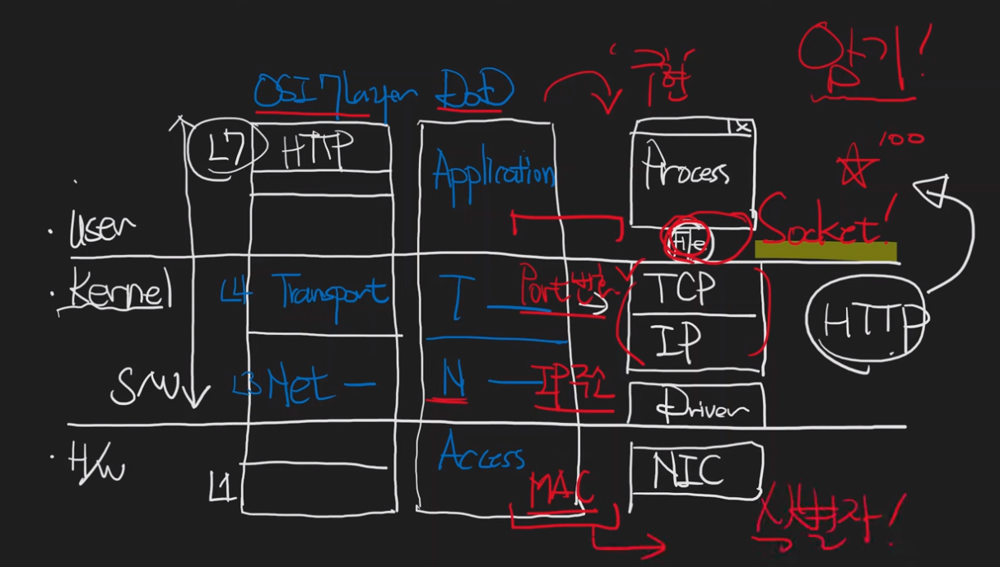
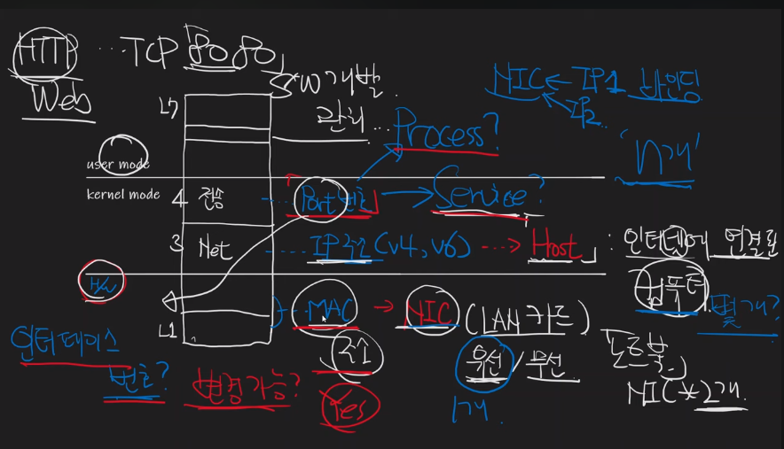
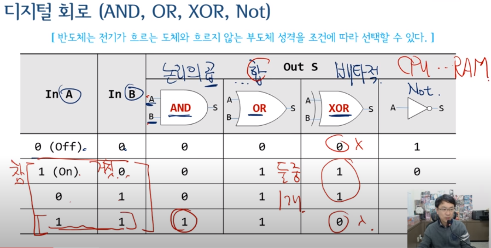
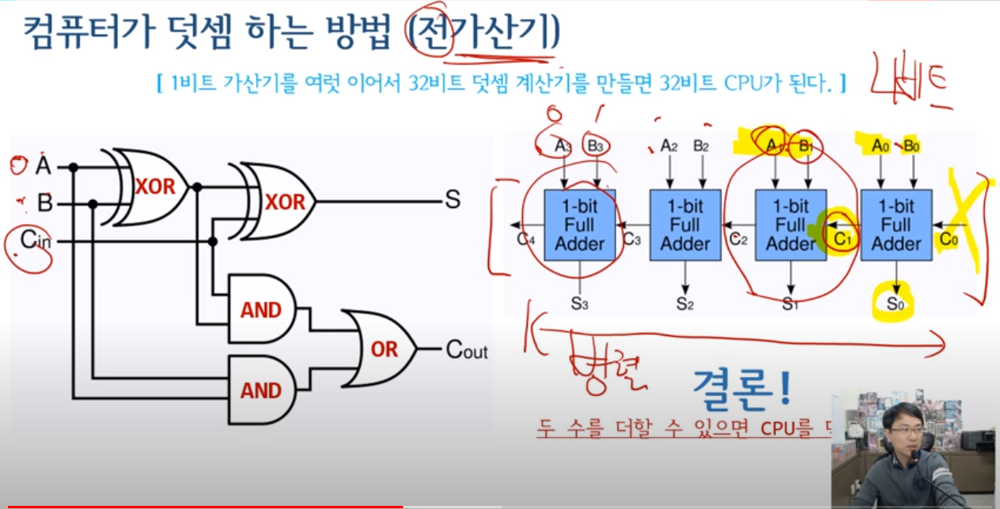
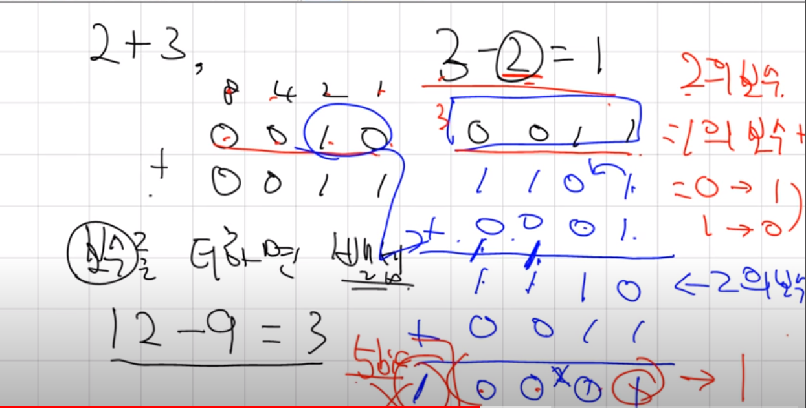
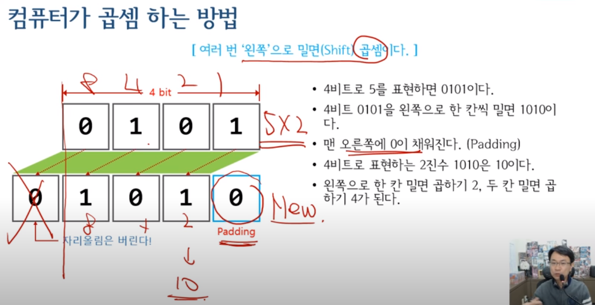
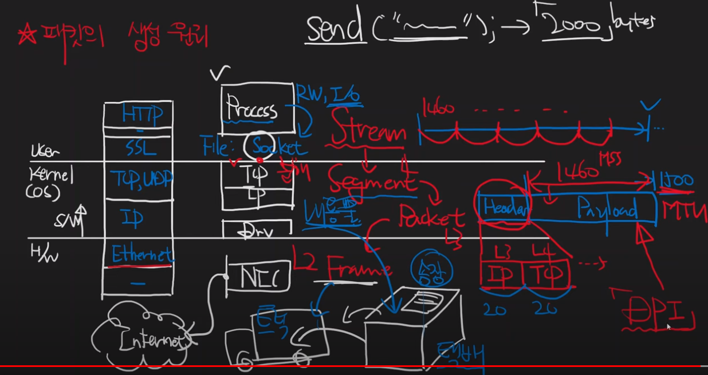

# CS 공부

## 목적  

국비지원 학원 6개월을 다니기로 했다.  
합리적인 이유로는 
1. 자소서 및 자료정리, 포폴제작, C#외의 언어공부등 시간을 벌기 위한 의도
2. 취업트랜드에 맞게 공부
3. 모르는게 있을것에 대한 보완.
4. 회사에 맞게 사람을 변환
5. 체력기르기
6. 사회적인 긴장감을 유지할 환경을 조성

비합리적인 이유로는
1. 학원딱지
2. 게임외에 유니티사용 기업을 갈 확률이 높아진다.
3. 이 실력에 학원갈 이유가 있나?
4. 취업시장이 어덯게 될지 모른다. 3월을 보는중

4년동안 1인개발하다가 좀더 많은 노하우와 커리어가 필요하여 취업을 하기로 결정.
취업을 위한 의도로 최근 취업트랜드에 맞게 공부를 하려함

## 요구사항 & 조사

전공서적책을 꺼내서 일일히 보는것보다는 필요한것만 추출

넓고 얕게 배우는 컴퓨터구조, 자료구조와 알고리즘, 프로그래밍, 운영체제
https://www.youtube.com/playlist?list=PLXvgR_grOs1BQCziQ_MpM877BdBxwbMzA

---

#### 20230203
7시간동안 핵심만 배울수 있게, 인생에 바보같은 질문은 없습니다.  

IT하면서 필요한 최소한을 딱딱 모이놓음

1. 컴퓨터관련 기본 용어 정리
입문 관련 용어
용어 정리할때 다나와가 제일 좋아보인다.

컴퓨터구조다 하면 CPU를 말하는것이다  

다나와 용어사전이 굉장히 잘해났다.
다나와에 있는 말들만 이해하면 끝난다.
다나와를 잘 봐라

컴퓨터는 크게 A.소프트웨어 B.하드웨어로 나누어져있다.
컴퓨터를 이루는 가장중요한 3가지요소는 소프트웨어, 하드웨어, 응용프로그램으로 이루어져있다.

A.소프트웨어 
A-1. 응용
A-2 .시스템
B.하드웨어

CPU (Central Process Unit)와 메인보드

CPU는 컴퓨터의 정체성을 결정하는 핵심 부품이다.
CPU는 전기도 많이 쓰고 열도 많이남
열이 많이나는걸 식혀주기 위해
쿨러라고 필요함

장착하는 구역을 슬롯이라고 부름

CPU가 들어가는 구역은 소켓이라고 함

전기를 꽂는 구역

DDR : 램메모
칩셋 : 입출력과 관련된 브릿지칩셋
알류미늄로 되있는 칩셋들이 입출력 칩셋

RAM (Random Access Memory)
CPU의 연산을 돕는 1등 공신(주기억장치)으로 가장 중요한 부품 중 하나다.
전원을 끄면 내용이 사라진다. 
자료라는게 Ram이라는곳으로 가져온뒤 연산
2400MHZ = 속도
8GB = 용량

MainBoard
컴퓨터의 핵심부품들이 장착되는 회로기판
컴퓨터부품에서 제일큰애가 메인보드
SATA = 외부기기 연결
PCI Express = 외부기기 연결
CPU와 Ram 사이에서 정보를 주거니 받거니 할때 메인보드에 또다른 칩셋에서 처리

HDD와 SSD (feat.USB Disk)(보조)
일시적인 기억을 장기 기억으로 전환할때 필요한 장치이다.
전원을 꺼도 내용이 사라지지 않는다.

정보를 RAM쪽에 보내고 RAM에 있는걸 CPU가 가져가서 연산을 함

SSD는 NAND Flash Memory를 이용하여 구조적으로 달라지고 속도가 매우 빠름

RPM 회전속도 = 회전이 빨라질수록 입출력(저장)I/O가 빨라질것이다.

하드디스크들의 인터페이스들은 SATA들이다.

컴퓨터 속의 모든정보는 숫자이다.

주변기기 연결 인터페이스 
USB D-Sub DVI HDMI 등등
컴퓨터에 연결되는 모든장치들을 주변기기라

### 컴퓨터하면 대략 이정도가 컴퓨터

### 20230204

정리
컴퓨터부품으로 제일 큰 부품은 메인보드이다

메인보드위에는 CPU를 올리고 주 기억장치인RAM을
올린다.

CPU와 RAM에 있는 정보를 주고받을때 메인보드내에
칩셋에서 처리해준다

메인보드와 보조기억장치를 이어줄때 
SATA로 연결된다.

컴퓨터라고 하면 컴퓨터속의 모든정보는
모조리 숫자이다.

숫자로 되있는 정보를 CPU에 들어와서 연산을한다

보조기억장치(1)에서 가져와서
주기억장치(2)로 가져온후 CPU(3)에서 연사을 했더니

소리를 내는 데이터면
사운드카드로 데이터를 보내서
스피커를 울리게함

VGA 비디오카드 => 모니터(시각화)
GPU 그래픽연산에 대한 장치가 있음

### 핵심은 CPU RAM 보조기억장치 쪽이다

1비트에서 진법변환까지

컴퓨터의 구조를 공부를 할려면 CPU의 구조를 공부해야되는데
반드시 알아야 될 2가지
1. 1비트를 알아야된다. (1bit)
2. 진법변환을 알아야된다.

1비트란 전기스위치 1개를 의미한다
전기가 흐르는 on상태는 1
전기가 흐르지 않는 Off상태는 0이다.

전기스위치 하나가 1비트이다.

한 위치에 올수 있는 숫자가 0~1사이밖에 안되는
2가지경우만 있는데 이렇게 2진수로 표현

0110 네자리숫자

이진수를 십진수로 바꾸는걸 어렵지 않다. 이러한걸 
진법 변환이라고 한다

십집법

이진법

이렇게 변환 계산하여 이해할수 있게 한다.

경우의 수가 2가지인데 이걸 조합하여
2의 4제곱만큼 경우의 수가 생긴다.

위같은경우 4비트로 말하고
16가지 경우의수가 가능하다

### 1bit와 4GV (중요외우기)
여러비트를 조합함으로써 큰수를 표현할수 있다.
예를 들어 4비트는 0에서 2의4제곱 빼기 1까지 표현한다.
(16가지의 경우수를 가지며 0~15까지 있다)

8개 비트를 하나로 묶어 1바이트(Byte)라 한다
1바이트는 영문자 한 글자가 저장될수 있는 메모리크기다.
한글 한글자를 저장할려면 2바이트가 필요하다
2의 10 제곱은 1024이다
2의 32 제곱은 4294967296 바이트 이다. 4GB(기가바이트)
2의 32 제곱은 32Bit를 의미한다. 즉 32비트 구조의 한계용량은 4GB이다
4비트의 16가지, 8비트는 256가지, 16비트는 65536 이다. 
#### 일단 이렇게 외우자

단위가 올라갈때 무게같은 경우 천단위로 끓는다. (1kg -> 1000g)
컴퓨터는 1024단위이다.

2가지는 무조건 외우기

### 20230206

### 진법변환

1비트-> 전기스위치 1개
4개의 스위치가 4bit 
4 + 4 = 8bit => 1byte
4bit는 16진수

0 1 2 3 4 5 6 7 8 9 A B C D E F 16진법
4비트는 16진수 한자리숫자다
16진수는 0~F 까지 한자리에 표기한다.

0x73 => 이진수 표현할려면
7(4bit) + 3(4bit) = 8bit(1Byte)

8 4 2 1 - 8 4 2 1  
0 1 1 1 - 0 0 1 1  

16에 1제곱 = 16
16에 0제곱 = 1
그러니까

(16 * 7)  + (1 * 3) = 115

IT 기술은 이렇게 가져가니까
이걸 잘알고 있어라

x의 제곱 => pow  
16에 2제곱 = 256  
16에 1제곱 = 16  
16에 0제곱 = 1  

x의 루트 => sqrt  
16에 루트 = 4  
4에 루트 = 2  

#### 이방식이 빠르고 편하네. 맘에듬
(1)
2진수 1100 0011
16진수 c    3
10진수 12 * 16 + 3 = 195

(2)
2진수 1100 0011
128 64 32 16 8 4 2 1 
128 64  0  0 0 0 2 1 = 195

### OSI7레이어(개념)

무엇에 대한 식별자인지 생각해보기

Port 
IP주소(V4V6) -> Host(인터넷에 연결된 컴퓨터)
Mac -> NIC(LAN카드) 유선/무선 노트북 NIC(2개)

컴퓨터 하나가 여러개의 IP주소를 가질수 있냐
네 N개를 가질수 있다.
바인딩N개

Mac 물리주소를 바꿀수 있는가?
네 바꿀수 있다.

Port번호 뭐에 대한 식별자인가?
프로세스식별자? (SW개발관리)
서비스? (네트워크관리)
인터페이스 번호?

User Mode

KernelMode

H/W

IP주소나 Mac번호는 특별한 이슈는 없지만
Port번호에 대해서는 여러가지형태로 식별대상이 달라진다.

### 20230209

### CPU가 작동하는 원리

컴퓨터라는 기계의 핵심은 CPU.  
디지털회로 (And, Or, Xor, Not)
And 논리의곱  
Or 논리의 합
xor 베타적(양쪽이 같으면 0, 다르면 1)
0 false
1 true

4개의 논리식을 알면 CPU, Ram을 만들수 있다.

5V 사용  
14번에 칩을 구동하기 위한 전력이 들어옴  
7번에 그라운드  

7408칩

논리회로를 조합해 가산기를 만들고 1비트 뎃셈연산을 할수 있음.
S => 현재 값
C => 자리올림인지 아닌지

이런한 회로를 구현하는 명칭이 (반)가산기라 함

1비트 가산기를 여러개를 이어 32비트덧셈계산기를 만들면 
32비트 CPU가 된다.

0이든 1이 오든 계산해주는게 가산기

A B 신호두개 C 3개가 와서 여러개가 이어붙혀지면 전가산기
4개면 4비트 전가산기

#### 컴퓨터라는 기계는 덧셈만하면 모든게 끝남

왜나하면 보수를 더하면 뺼셈이 되므로

2의보수 = 1의보수 = 0 -> 1, 1 <- 0  으로 뒤집기

※보수 : 보충되는수, 10이면 9, 2면 1.  
특정 숫자를 채우게 하는데 필요한 수를 말한다
`역`, `반대`, `수를 거꾸로 세는 방식`
`여집합(餘)/보집합(補)에서 여수/보수` 등

3 - 2 = 1 이 있으면

0 0 1 1 
0 0 1 0 =>의 뒤집기 변환시작(Not논리회로)

1 1 0 1 + 1 = 1 1 1 0(2의 보수)

※Not + n = 빼기할대상 완성 (n = x진법 - 1)

0 0 1 1 
1 1 1 0

1 0 0 0 1
왼쪽에 있는 1은 5비트인데
4비트까지니까 1은 없애버린다.
그럼 0 0 0 1 이나오고 1이라는 결과값이 도출됨

컴퓨터는 더하는방식으로 뺀다.
자리올림을 무시하면 자동으로 빼기가 되니까.  
이사실을 잊지말고 기억해줘라

13 - 6 = 7
13 + 4(보수) = 17 -> 앞자리를 없애면 7

허어 신기한데

대충 123 - 64를 해봣는데

64의 보수는 36 이다
자리수마다 3 + 6, 6 + 4 
대략앞에서 계속 꿔올때 9로 체크
고로 보수는 36

123 + 36 = 159
앞자리 없애면
59
  

곱셈, 나눗셈 관련
여러번 더하면 곱셈

7 * 2 = 7 + 7

여러번 빼면 나누기

9 / 3 인 경우
(9 - 3 = 6) >= 3
(6 - 3 = 3) >= 3
(3 - 3 = 0) >= 3 
3번뺏기때문 9/3은 3이다

7 / 0 을 나누면
7 - 0 >= 0
7 - 0 을 끝없이 반복함

(칩이 터졍)

컴퓨터가 곱셈할때는
왼쪽으로 한번 밀기 

8 4 2 1
0 1 0 1 = 5

8 4 2 1
1 0 1 0 = 10

채워넣는건 Padding
자리올림나는건 버리기

컴퓨터가 나눌때는
오른쪽으로 한번 밀기

8 4 2 1
0 1 0 1 = 5

8 4 2 1
0 0 1 0 = 2

8 4 2 1
0 1 1 0 = 6

8 4 2 1
0 0 1 1 = 3

 

#### 2023..

헉 기억장치에 대한 이제부터 유료임!

#### 20230213

#### 네트워크 데이터 단위 정리 (매우 중요!)

패킷(Packet)
어떤데이터 덩어리

스트림

IP 수준에서 놀아다니는 수준보다 길어질수 있다
TCP 수준에서 놀아다니는 단위는 Segment
IP 수준에서 놀아다니는 단위는 Socket

Stream
분해 자르기

일정길이의 최대크기
(MSS)Maximum Segment Size

Packet의 최대크기에 따라 달라짐
(MTU) Maximum Trans Unit 1500bytes

적어도 천개쯤 나감
잘게 분해되서 날라감

Frame으로 인캡슐레이션이됨

데이터단위
1. Socket 수준에서는 Steam데이터. 
그 끝을 알수 없는 1열로 쭉 나열된 데이터.
이걸 네트워크로 보낼떄는 분할(Segmention)

2. 분할된 조각 하나가 세그먼트라고 한다
3. 그걸 인터넷 환경에서 전송가능한 형태로 포장한걸 패킷
4. 이 패킷을 최대크기는 1500 byte 정도한다.
5. MSS는 MTU보다 당연히 작다. (상자크기에 들어가야되니까)
6. 이 패킷을 뿌릴때는 Frame 데이터에 넣는다

#### 패킷의 생성 원리와 캡슐화

네트워크도 알고 개발도 알아야 설명가능한 구역
데이터 단위 이야기를 한적이 있다.
모든 프로그램이라는게 어떤 유저어플프로세스가 있다고하면
바로 밑에 TCP IP가 있으면 그밑에 디바이스 드라이버가 있고
맨아래에 네트워크 인터넷 카드가 있어서 유선일 경우
랜케이블끼어서 인터넷으로 간다.

TCP라는 요소를 유저모드어플프로세스가 접근할수 있도록 추상화한
인터페이스가 소켓(Socket)이다.

소켓의 본질은 파일(File)의 일종이다

중요한건 데이터단위이다.
Stream을 쪼개서 Segment들이 있고 
이걸 Packet으로 만들어서 전송하는데
Packet 내부는 Header(40byte),Payload(1460byte)로
Header는 IP(L3, 20byte), TCP(L4, 20byte)

Packet는 택배
Header가 송장
Payload가 내용물. Segment가 여기 안에 있음

-=레이어
Segment L4
Packet L3
Frame L2

Packet의 Payload까지 다 뒤지면 
DPI(Deep Packet Inspection)

#### 20230214

